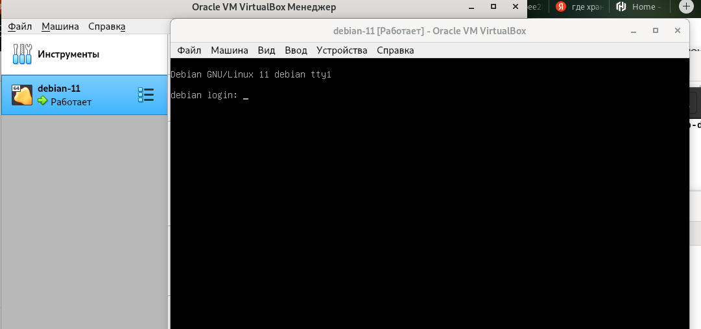

# Домашнее задание к занятию «Введение в Terraform»

------

### Чек-лист готовности к домашнему заданию

1. Скачайте и установите актуальную версию **Terraform** >=1.4.X . Приложите скриншот вывода команды ```terraform --version```.

```
beatl@ProBookB:~$ terraform --version
Terraform v1.5.3
on linux_amd64
```

2. Скачайте на свой ПК этот git-репозиторий. Исходный код для выполнения задания расположен в директории **01/src**.

```
beatl@ProBookB:~$ git clone https://github.com/netology-code/ter-homeworks.git
Клонирование в «ter-homeworks»…
remote: Enumerating objects: 865, done.
remote: Counting objects: 100% (262/262), done.
remote: Compressing objects: 100% (132/132), done.
remote: Total 865 (delta 188), reused 163 (delta 130), pack-reused 603
Получение объектов: 100% (865/865), 199.60 KiB | 1.75 MiB/s, готово.
Определение изменений: 100% (448/448), готово.
```
3. Убедитесь, что в вашей ОС установлен docker.
```
beatl@ProBookB:~/ter-homeworks$ docker -v
Docker version 24.0.5, build ced0996
```
4. Зарегистрируйте аккаунт на сайте https://hub.docker.com/, выполните команду docker login и введите логин, пароль.

```
beatl@ProBookB:~$ sudo docker login -u beatljs
[sudo] пароль для beatl: 
Password: 
WARNING! Your password will be stored unencrypted in /root/.docker/config.json.
Configure a credential helper to remove this warning. See
https://docs.docker.com/engine/reference/commandline/login/#credentials-store

Login Succeeded

```

------

### Задание 1

1. Перейдите в каталог [**src**](https://github.com/netology-code/ter-homeworks/tree/main/01/src). Скачайте все необходимые зависимости, использованные в проекте. 

```
beatl@ProBookB:~/ter-homeworks/01/src$ terraform init

Initializing the backend...

Initializing provider plugins...
- Reusing previous version of hashicorp/random from the dependency lock file
- Reusing previous version of kreuzwerker/docker from the dependency lock file
- Using previously-installed hashicorp/random v3.5.1
- Using previously-installed kreuzwerker/docker v3.0.2

Terraform has been successfully initialized!

You may now begin working with Terraform. Try running "terraform plan" to see
any changes that are required for your infrastructure. All Terraform commands
should now work.

If you ever set or change modules or backend configuration for Terraform,
rerun this command to reinitialize your working directory. If you forget, other
commands will detect it and remind you to do so if necessary.

```

2. Изучите файл **.gitignore**. В каком terraform-файле, согласно этому .gitignore, допустимо сохранить личную, секретную информацию?

```
personal.auto.tfvars
```

3. Выполните код проекта. Найдите  в state-файле секретное содержимое созданного ресурса **random_password**, пришлите в качестве ответа конкретный ключ и его значение.

```
random_password.random_string.result: "fnl7LMp7NdzD5Hni"
```

4. Раскомментируйте блок кода, примерно расположенный на строчках 29–42 файла **main.tf**.
Выполните команду ```terraform validate```. Объясните, в чём заключаются намеренно допущенные ошибки. Исправьте их.

_- Ошибка строка 23: отсутствует имя ресурса_
_- Ошибка строка 28: неправильное имя ресурса. Имя ресурса не может начинаться с цифры_
_- Ошибка строка 30: ссылка на неизвестный ресурс-".random_string_FAKE.resulT"_ 

5. Выполните код. В качестве ответа приложите вывод команды ```docker ps```.

```
Apply complete! Resources: 2 added, 0 changed, 0 destroyed.
beatl@ProBookB:~/ter-homeworks/01/src$ sudo docker ps
CONTAINER ID   IMAGE          COMMAND                  CREATED          STATUS          PORTS                  NAMES
e12f68ce9693   021283c8eb95   "/docker-entrypoint.…"   58 seconds ago   Up 57 seconds   0.0.0.0:8000->80/tcp   example_fnl7LMp7NdzD5Hni
```

6. Замените имя docker-контейнера в блоке кода на ```hello_world```. Не перепутайте имя контейнера и имя образа. Мы всё ещё продолжаем использовать name = "nginx:latest". Выполните команду ```terraform apply -auto-approve```.
Объясните своими словами, в чём может быть опасность применения ключа  ```-auto-approve```. В качестве ответа дополнительно приложите вывод команды ```docker ps```.

_Опасность применения -auto-approve заключается в том, что нет возможности ознакомиться с измениями в инфастуктуре которые сделает terraform, вовремя заметиь ошибку и отказаться от неправильных действий._

```
Apply complete! Resources: 1 added, 0 changed, 0 destroyed.
beatl@ProBookB:~/ter-homeworks/01/src$ sudo docker ps
CONTAINER ID   IMAGE          COMMAND                  CREATED         STATUS         PORTS                  NAMES
1a824080993a   021283c8eb95   "/docker-entrypoint.…"   8 seconds ago   Up 7 seconds   0.0.0.0:8000->80/tcp   hello_world
```

8. Уничтожьте созданные ресурсы с помощью **terraform**. Убедитесь, что все ресурсы удалены. Приложите содержимое файла **terraform.tfstate**.

```
{
  "version": 4,
  "terraform_version": "1.5.3",
  "serial": 13,
  "lineage": "81dc6082-55ac-c163-c125-883755b40ebe",
  "outputs": {},
  "resources": [],
  "check_results": null
}
```

```
beatl@ProBookB:~/ter-homeworks/01/src$ sudo docker ps 
CONTAINER ID   IMAGE     COMMAND   CREATED   STATUS    PORTS     NAMES
```

9. Объясните, почему при этом не был удалён docker-образ **nginx:latest**. Ответ подкрепите выдержкой из документации [**провайдера docker**](https://docs.comcloud.xyz/providers/kreuzwerker/docker/latest/docs).  

_docker-образ не удален т.к. keep_locally = true._


> keep_locally (Boolean) If true, then the Docker image won't be deleted on destroy operation. If this is false, it will delete the image from the docker local storage on destroy operation.


------

## Дополнительное задание (со звёздочкой*)

### Задание 2*

1. Изучите в документации provider [**Virtualbox**](https://docs.comcloud.xyz/providers/shekeriev/virtualbox/latest/docs) от 
shekeriev.
2. Создайте с его помощью любую виртуальную машину. Чтобы не использовать VPN, советуем выбрать любой образ с расположением в GitHub из [**списка**](https://www.vagrantbox.es/).

В качестве ответа приложите plan для создаваемого ресурса и скриншот созданного в VB ресурса. 

```
beatl@ProBookB:~/ter-homeworks/01/VB$ terraform apply

Terraform used the selected providers to generate the following execution plan.
Resource actions are indicated with the following symbols:
  + create

Terraform will perform the following actions:

  # virtualbox_vm.vm1 will be created
  + resource "virtualbox_vm" "vm1" {
      + cpus   = 1
      + id     = (known after apply)
      + image  = "https://app.vagrantup.com/shekeriev/boxes/debian-11/versions/0.2/providers/virtualbox.box"
      + memory = "512 mib"
      + name   = "debian-11"
      + status = "running"

      + network_adapter {
          + device                 = "IntelPro1000MTDesktop"
          + host_interface         = "vboxnet0"
          + ipv4_address           = (known after apply)
          + ipv4_address_available = (known after apply)
          + mac_address            = (known after apply)
          + status                 = (known after apply)
          + type                   = "hostonly"
        }
    }

Plan: 1 to add, 0 to change, 0 to destroy.

Changes to Outputs:
  + IPAddress = (known after apply)

Do you want to perform these actions?
  Terraform will perform the actions described above.
  Only 'yes' will be accepted to approve.

  Enter a value: yes

virtualbox_vm.vm1: Creating...
virtualbox_vm.vm1: Still creating... [10s elapsed]
virtualbox_vm.vm1: Still creating... [20s elapsed]
virtualbox_vm.vm1: Still creating... [30s elapsed]
virtualbox_vm.vm1: Still creating... [40s elapsed]
virtualbox_vm.vm1: Still creating... [50s elapsed]
virtualbox_vm.vm1: Still creating... [1m0s elapsed]
virtualbox_vm.vm1: Still creating... [1m10s elapsed]
virtualbox_vm.vm1: Still creating... [1m20s elapsed]
virtualbox_vm.vm1: Still creating... [1m30s elapsed]
virtualbox_vm.vm1: Still creating... [1m40s elapsed]
virtualbox_vm.vm1: Still creating... [1m50s elapsed]
virtualbox_vm.vm1: Still creating... [2m0s elapsed]
virtualbox_vm.vm1: Still creating... [2m10s elapsed]
virtualbox_vm.vm1: Still creating... [2m20s elapsed]
virtualbox_vm.vm1: Creation complete after 2m20s [id=151a771b-d081-4f3b-8662-284b83e704cc]

Apply complete! Resources: 1 added, 0 changed, 0 destroyed.

Outputs:

IPAddress = "192.168.56.102"
```



------


