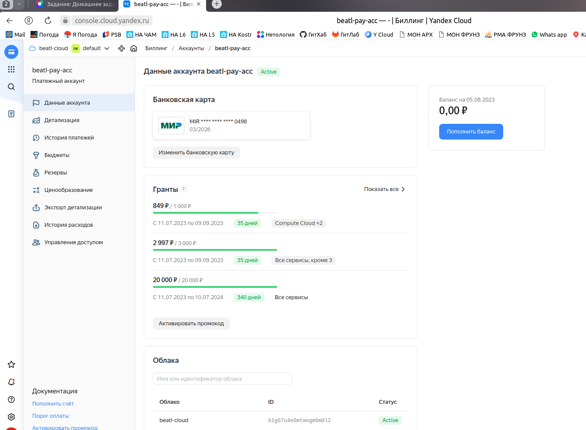

# Домашнее задание к занятию «Основы Terraform. Yandex Cloud»

---

### Чек-лист готовности к домашнему заданию

1. Зарегистрирован аккаунт в Yandex Cloud. Использован промокод на грант.



2. Установлен инструмент Yandex CLI.

```
beatl@OWEN:~$ yc -v
Yandex Cloud CLI 0.108.1 linux/amd64
```

3. Исходный код для выполнения задания расположен в директории [**02/src**](https://github.com/netology-code/ter-homeworks/tree/main/02/src).

---

### Задание 0

1. Ознакомьтесь с [документацией к security-groups в Yandex Cloud](https://cloud.yandex.ru/docs/vpc/concepts/security-groups?from=int-console-help-center-or-nav).
2. Запросите preview-доступ к этому функционалу в личном кабинете Yandex Cloud. Обычно его выдают в течение 24-х часов.
https://console.cloud.yandex.ru/folders/<ваш cloud_id>/vpc/security-groups.
Этот функционал понадобится к следующей лекции. 

_С документацией ознакомился_
_Запрос послал_ 

---

### Задание 1

1. Изучите проект. В файле variables.tf объявлены переменные для Yandex provider.
2. Переименуйте файл personal.auto.tfvars_example в personal.auto.tfvars. Заполните переменные: идентификаторы облака, токен доступа. Благодаря .gitignore этот файл не попадёт в публичный репозиторий. **Вы можете выбрать иной способ безопасно передать секретные данные в terraform.**
3. Сгенерируйте или используйте свой текущий ssh-ключ. Запишите его открытую часть в переменную **vms_ssh_root_key**.
4. Инициализируйте проект, выполните код. Исправьте намеренно допущенные синтаксические ошибки. Ищите внимательно, посимвольно. Ответьте, в чём заключается их суть.

_1 ошибка: Неверное название платформы. У Яндекса нет такой. Исправил на 'standard-v1'_

_2 ошибка: Неверно указано количество процессоров и размер памяти. Исправил в соответствии с одним из вариантов по документации yandex.cloud_


```
beatl@OWEN:~/ter-homeworks/02/src$ terraform apply
data.yandex_compute_image.ubuntu: Reading...
yandex_vpc_network.develop: Refreshing state... [id=enpp1qn4h5hq6aq1ug4e]
data.yandex_compute_image.ubuntu: Read complete after 2s [id=fd8s1rt9rlesqptbevhg]
yandex_vpc_subnet.develop: Refreshing state... [id=e9b8e5768mavqto28df3]

Terraform used the selected providers to generate the following execution plan.
Resource actions are indicated with the following symbols:
  + create

Terraform will perform the following actions:

  # yandex_compute_instance.platform will be created
  + resource "yandex_compute_instance" "platform" {
      + created_at                = (known after apply)
      + folder_id                 = (known after apply)
      + fqdn                      = (known after apply)
      + gpu_cluster_id            = (known after apply)
      + hostname                  = (known after apply)
      + id                        = (known after apply)
      + metadata                  = {
          + "serial-port-enable" = "1"
          + "ssh-keys"           = "ubuntu:ssh-ed25519 AAAAC3NzaC1lZDI1NTE5AAAAIFzIYA9F1G3dSQ6Ngnk+XSFESJgTn1Rx4ghJ0wv6WSvN beatl@OWEN"
        }
      + name                      = "netology-develop-platform-web"
      + network_acceleration_type = "standard"
      + platform_id               = "standard-v1"
      + service_account_id        = (known after apply)
      + status                    = (known after apply)
      + zone                      = (known after apply)

      + boot_disk {
          + auto_delete = true
          + device_name = (known after apply)
          + disk_id     = (known after apply)
          + mode        = (known after apply)

          + initialize_params {
              + block_size  = (known after apply)
              + description = (known after apply)
              + image_id    = "fd8s1rt9rlesqptbevhg"
              + name        = (known after apply)
              + size        = (known after apply)
              + snapshot_id = (known after apply)
              + type        = "network-hdd"
            }
        }

      + network_interface {
          + index              = (known after apply)
          + ip_address         = (known after apply)
          + ipv4               = true
          + ipv6               = (known after apply)
          + ipv6_address       = (known after apply)
          + mac_address        = (known after apply)
          + nat                = true
          + nat_ip_address     = (known after apply)
          + nat_ip_version     = (known after apply)
          + security_group_ids = (known after apply)
          + subnet_id          = "e9b8e5768mavqto28df3"
        }

      + resources {
          + core_fraction = 5
          + cores         = 2
          + memory        = 2
        }

      + scheduling_policy {
          + preemptible = true
        }
    }

Plan: 1 to add, 0 to change, 0 to destroy.

Do you want to perform these actions?
  Terraform will perform the actions described above.
  Only 'yes' will be accepted to approve.

  Enter a value: yes

yandex_compute_instance.platform: Creating...
yandex_compute_instance.platform: Still creating... [10s elapsed]
yandex_compute_instance.platform: Still creating... [20s elapsed]
yandex_compute_instance.platform: Still creating... [30s elapsed]
yandex_compute_instance.platform: Creation complete after 32s [id=fhmsvd76gs9u5hou1dif]

Apply complete! Resources: 1 added, 0 changed, 0 destroyed.

```

5. Ответьте, как в процессе обучения могут пригодиться параметры ```preemptible = true``` и ```core_fraction=5``` в параметрах ВМ. Ответ в документации Yandex Cloud.

В качестве решения приложите:

- скриншот ЛК Yandex Cloud с созданной ВМ;
- скриншот успешного подключения к консоли ВМ через ssh. К OS ubuntu необходимо подключаться под пользователем ubuntu: "ssh ubuntu@vm_ip_address";
- ответы на вопросы. 

#### Решение 1.5

- скриншот ЛК Yandex Cloud с созданной ВМ;



- скриншот успешного подключения к консоли ВМ через ssh. К OS ubuntu необходимо подключаться под пользователем ubuntu: "ssh ubuntu@vm_ip_address";

```
beatl@OWEN:~/ter-homeworks/02/src$ ssh ubuntu@158.160.52.0
The authenticity of host '158.160.52.0 (158.160.52.0)' can't be established.
ECDSA key fingerprint is SHA256:h6uXooklWukCqNiWvAOXdtovEALbPK7EJho6xytvLYs.
Are you sure you want to continue connecting (yes/no)? yes
Warning: Permanently added '158.160.52.0' (ECDSA) to the list of known hosts.
Welcome to Ubuntu 20.04.6 LTS (GNU/Linux 5.4.0-155-generic x86_64)

 * Documentation:  https://help.ubuntu.com
 * Management:     https://landscape.canonical.com
 * Support:        https://ubuntu.com/advantage

The programs included with the Ubuntu system are free software;
the exact distribution terms for each program are described in the
individual files in /usr/share/doc/*/copyright.

Ubuntu comes with ABSOLUTELY NO WARRANTY, to the extent permitted by
applicable law.

To run a command as administrator (user "root"), use "sudo <command>".
See "man sudo_root" for details.
```
```
ubuntu@fhmsvd76gs9u5hou1dif:/etc$ lsb_release -a
No LSB modules are available.
Distributor ID:	Ubuntu
Description:	Ubuntu 20.04.6 LTS
Release:	20.04
Codename:	focal
```

- ответы на вопросы.

``` 
core_fraction=5 
```

> При создании каждой виртуальной машины необходимо выбирать уровень производительности vCPU. Этот уровень определяет долю вычислительного времени физических ядер, которую гарантирует vCPU.

> Виртуальные машины с уровнем производительности меньше 100% имеют доступ к вычислительной мощности физических ядер как минимум на протяжении указанного процента от единицы времени.

> При уровне производительности 20% ВМ будет иметь доступ к физическим ядрам как минимум 20% времени — 200 миллисекунд в течение каждой секунды. Тактовая частота процессора в это время не ограничивается и соответствует выбранной платформе.

```
preemptible = true
```
 
_- сделать витруальную машину прерываемой_

> Прерываемые виртуальные машины — это виртуальные машины, которые могут быть принудительно остановлены в любой момент. Это может произойти в двух случаях:

> Если с момента запуска виртуальной машины прошло 24 часа.

> Если возникнет нехватка ресурсов для запуска обычной виртуальной машины в той же зоне доступности. Вероятность такого события низкая, но может меняться изо дня в день.

> Прерываемые виртуальные машины доступны по более низкой цене в сравнении с обычными, однако не обеспечивают отказоустойчивости.

---

### Задание 2

1. Изучите файлы проекта.
2. Замените все хардкод-**значения** для ресурсов **yandex_compute_image** и **yandex_compute_instance** на **отдельные** переменные. К названиям переменных ВМ добавьте в начало префикс **vm_web_** .  Пример: **vm_web_name**.
2. Объявите нужные переменные в файле variables.tf, обязательно указывайте тип переменной. Заполните их **default** прежними значениями из main.tf. 

_Добавленные объявления переменных:_


```
variable "vm_web_family" {
  type        = string
  default     = "ubuntu-2004-lts"
  description = "yandex_compute_image.family"
}  

variable "vm_web_instanse_name" {
  type        = string
  default     = "netology-develop-platform-web"
  description = "yandex_compute_instance.name"
}  

variable "vm_web_patform_id" {
  type        = string
  default     = "standard-v1"
  description = "yandex_compute_instance.platform_id"
}  

variable "vm_web_cores" {
  type        = number
  default     = 2
  description = "yandex_compute_instance.cores"
}  

variable "vm_web_memory" {
  type        = number
  default     = 2
  description = "yandex_compute_instance.memory"
}  

variable "vm_web_core_fraction" {
  type        = number
  default     = 5
  description = "yandex_compute_instance.core_fraction"
}                          ```
```

3. Проверьте terraform plan. Изменений быть не должно. 


```
beatl@ProBookB:~/ter-homeworks/02/src$ terraform plan
data.yandex_compute_image.ubuntu: Reading...
yandex_vpc_network.develop: Refreshing state... [id=enpc0gp4nsbmf31k4j70]
yandex_vpc_subnet.develop: Refreshing state... [id=e9bvd9qpuisa71hd7fgn]
data.yandex_compute_image.ubuntu: Read complete after 3s [id=fd8s1rt9rlesqptbevhg]
yandex_compute_instance.platform: Refreshing state... [id=fhm4uo8vibjao66hrh6s]

No changes. Your infrastructure matches the configuration.

Terraform has compared your real infrastructure against your configuration and
found no differences, so no changes are needed.
```

---

### Задание 3

1. Создайте в корне проекта файл 'vms_platform.tf' . Перенесите в него все переменные первой ВМ.
2. Скопируйте блок ресурса и создайте с его помощью вторую ВМ в файле main.tf: **"netology-develop-platform-db"** ,  cores  = 2, memory = 2, core_fraction = 20. Объявите её переменные с префиксом **vm_db_** в том же файле ('vms_platform.tf').

_Новые переменные:_

```
# 2 VM

variable "vm_db_family" {
  type        = string
  default     = "ubuntu-2004-lts"
  description = "yandex_compute_image.family"
}  

variable "vm_db_instanse_name" {
  type        = string
  default     = "netology-develop-platform-db"
  description = "yandex_compute_instance.name"
}  

variable "vm_db_patform_id" {
  type        = string
  default     = "standard-v1"
  description = "yandex_compute_instance.platform_id"
}  

variable "vm_db_cores" {
  type        = number
  default     = 2
  description = "yandex_compute_instance.cores"
}  

variable "vm_db_memory" {
  type        = number
  default     = 2
  description = "yandex_compute_instance.memory"
}  

variable "vm_db_core_fraction" {
  type        = number
  default     = 20
  description = "yandex_compute_instance.core_fraction"
}  
```

3. Примените изменения.

```
beatl@ProBookB:~/ter-homeworks/02/src$ terraform apply
data.yandex_compute_image.ubuntu: Reading...
data.yandex_compute_image.ubuntu_2: Reading...
yandex_vpc_network.develop: Refreshing state... [id=enpc0gp4nsbmf31k4j70]
data.yandex_compute_image.ubuntu_2: Read complete after 2s [id=fd8s1rt9rlesqptbevhg]
data.yandex_compute_image.ubuntu: Read complete after 2s [id=fd8s1rt9rlesqptbevhg]
yandex_vpc_subnet.develop: Refreshing state... [id=e9bvd9qpuisa71hd7fgn]
yandex_compute_instance.platform: Refreshing state... [id=fhm4uo8vibjao66hrh6s]

Terraform used the selected providers to generate the following execution plan.
Resource actions are indicated with the following symbols:
  + create

Terraform will perform the following actions:

  # yandex_compute_instance.platform_2 will be created
  + resource "yandex_compute_instance" "platform_2" {
      + created_at                = (known after apply)
      + folder_id                 = (known after apply)
      + fqdn                      = (known after apply)
      + gpu_cluster_id            = (known after apply)
      + hostname                  = (known after apply)
      + id                        = (known after apply)
      + metadata                  = {
          + "serial-port-enable" = "1"
          + "ssh-keys"           = "ubuntu:ssh-ed25519 AAAAC3NzaC1lZDI1NTE5AAAAIFzIYA9F1G3dSQ6Ngnk+XSFESJgTn1Rx4ghJ0wv6WSvN beatl@OWEN"
        }
      + name                      = "netology-develop-platform-db"
      + network_acceleration_type = "standard"
      + platform_id               = "standard-v1"
      + service_account_id        = (known after apply)
      + status                    = (known after apply)
      + zone                      = (known after apply)

      + boot_disk {
          + auto_delete = true
          + device_name = (known after apply)
          + disk_id     = (known after apply)
          + mode        = (known after apply)

          + initialize_params {
              + block_size  = (known after apply)
              + description = (known after apply)
              + image_id    = "fd8s1rt9rlesqptbevhg"
              + name        = (known after apply)
              + size        = (known after apply)
              + snapshot_id = (known after apply)
              + type        = "network-hdd"
            }
        }

      + network_interface {
          + index              = (known after apply)
          + ip_address         = (known after apply)
          + ipv4               = true
          + ipv6               = (known after apply)
          + ipv6_address       = (known after apply)
          + mac_address        = (known after apply)
          + nat                = true
          + nat_ip_address     = (known after apply)
          + nat_ip_version     = (known after apply)
          + security_group_ids = (known after apply)
          + subnet_id          = "e9bvd9qpuisa71hd7fgn"
        }

      + resources {
          + core_fraction = 20
          + cores         = 2
          + memory        = 2
        }

      + scheduling_policy {
          + preemptible = true
        }
    }

Plan: 1 to add, 0 to change, 0 to destroy.

Do you want to perform these actions?
  Terraform will perform the actions described above.
  Only 'yes' will be accepted to approve.

  Enter a value: yes

yandex_compute_instance.platform_2: Creating...
yandex_compute_instance.platform_2: Still creating... [10s elapsed]
yandex_compute_instance.platform_2: Still creating... [20s elapsed]
yandex_compute_instance.platform_2: Still creating... [30s elapsed]
yandex_compute_instance.platform_2: Still creating... [40s elapsed]
yandex_compute_instance.platform_2: Still creating... [50s elapsed]
yandex_compute_instance.platform_2: Still creating... [1m0s elapsed]
yandex_compute_instance.platform_2: Creation complete after 1m3s [id=fhm4omj2ve7fgusbuuin]

Apply complete! Resources: 1 added, 0 changed, 0 destroyed.
```


---

### Задание 4

1. Объявите в файле outputs.tf output типа map, содержащий { instance_name = external_ip } для каждой из ВМ.

```
output "external_ip_address_platform_yandex_cloud" {
  value = "${yandex_compute_instance.platform.network_interface.0.nat_ip_address}"
}
output "external_ip_address_platform_2_yandex_cloud" {
  value = "${yandex_compute_instance.platform_2.network_interface.0.nat_ip_address}"
}
```

2. Примените изменения.

В качестве решения приложите вывод значений ip-адресов команды ```terraform output```.

```
beatl@ProBookB:~/ter-homeworks/02/src$ terraform output
external_ip_address_platform_2_yandex_cloud = "84.252.128.85"
external_ip_address_platform_yandex_cloud = "158.160.103.85"
```

----

### Задание 5

1. В файле locals.tf опишите в **одном** local-блоке имя каждой ВМ, используйте интерполяцию ${..} с несколькими переменными по примеру из лекции.

```
locals {
  name_vm1 = "${var.name_prefix}-${var.name_suff_vm1}"
  name_vm2 = "${var.name_prefix}-${var.name_suff_vm2}"
}  
```

2. Замените переменные с именами ВМ из файла variables.tf на созданные вами local-переменные.

```
resource "yandex_compute_instance" "platform" {
  name        = local.name_vm1 
#  name        = var.vm_web_instanse_name 

     ---- skip----

resource "yandex_compute_instance" "platform_2" {
  name        = local.name_vm2 
#  name        = var.vm_db_instanse_name 

     ---- skip----
```

3. Примените изменения.

```
beatl@ProBookB:~/ter-homeworks/02/src$ terraform apply
data.yandex_compute_image.ubuntu: Reading...
data.yandex_compute_image.ubuntu_2: Reading...
yandex_vpc_network.develop: Refreshing state... [id=enpc0gp4nsbmf31k4j70]
data.yandex_compute_image.ubuntu_2: Read complete after 2s [id=fd8s1rt9rlesqptbevhg]
data.yandex_compute_image.ubuntu: Read complete after 2s [id=fd8s1rt9rlesqptbevhg]
yandex_vpc_subnet.develop: Refreshing state... [id=e9bvd9qpuisa71hd7fgn]
yandex_compute_instance.platform: Refreshing state... [id=fhm4uo8vibjao66hrh6s]
yandex_compute_instance.platform_2: Refreshing state... [id=fhm4omj2ve7fgusbuuin]

No changes. Your infrastructure matches the configuration.

Terraform has compared your real infrastructure against your configuration and
found no differences, so no changes are needed.

Apply complete! Resources: 0 added, 0 changed, 0 destroyed.

Outputs:

external_ip_address_platform_2_yandex_cloud = "84.252.128.85"
external_ip_address_platform_yandex_cloud = "158.160.103.85"
```

---

### Задание 6

1. Вместо использования трёх переменных  ".._cores",".._memory",".._core_fraction" в блоке  resources {...}, объедините их в переменные типа **map** с именами "vm_web_resources" и "vm_db_resources". В качестве продвинутой практики попробуйте создать одну map-переменную **vms_resources** и уже внутри неё конфиги обеих ВМ — вложенный map.

```
variable "vms_resources" {
   default = {
      vm_web_resources = {
        cores = 2
        mem = 2
        core_fraction=5
      }
      vm_db_resources = {
        cores = 2
        mem = 2
        core_fraction=20
      }
   }   
}
```

2. Также поступите с блоком **metadata {serial-port-enable, ssh-keys}**, эта переменная должна быть общая для всех ваших ВМ.

```
variable "vms_metadata" {
  default = {
    serial-port-enable = 1
    ssh-key = "ubuntu:ssh-ed25519 AAAAC3NzaC1lZDI1NTE5AAAAIFzIYA9F1G3dSQ6Ngnk+XSFESJgTn1Rx4ghJ0wv6WSvN beatl@OWEN"
  }
}
```

3. Найдите и удалите все более не используемые переменные проекта.
4. Проверьте terraform plan. Изменений быть не должно.

```
beatl@ProBookB:~/ter-homeworks/02/src$ terraform plan
data.yandex_compute_image.ubuntu_2: Reading...
yandex_vpc_network.develop: Refreshing state... [id=enpc0gp4nsbmf31k4j70]
data.yandex_compute_image.ubuntu: Reading...
data.yandex_compute_image.ubuntu: Read complete after 3s [id=fd8s1rt9rlesqptbevhg]
data.yandex_compute_image.ubuntu_2: Read complete after 3s [id=fd8s1rt9rlesqptbevhg]
yandex_vpc_subnet.develop: Refreshing state... [id=e9bvd9qpuisa71hd7fgn]
yandex_compute_instance.platform: Refreshing state... [id=fhm4uo8vibjao66hrh6s]
yandex_compute_instance.platform_2: Refreshing state... [id=fhm4omj2ve7fgusbuuin]

No changes. Your infrastructure matches the configuration.

Terraform has compared your real infrastructure against your configuration and
found no differences, so no changes are needed.
```

---

### Задание 7*

Изучите содержимое файла console.tf. Откройте terraform console, выполните следующие задания: 

1. Напишите, какой командой можно отобразить **второй** элемент списка test_list.

```
> local.test_list[1]
"staging"
```

2. Найдите длину списка test_list с помощью функции length(<имя переменной>).

```
> length(local.test_list)
3
```

3. Напишите, какой командой можно отобразить значение ключа admin из map test_map

```
> local.test_map.admin
"John"
```

4. Напишите interpolation-выражение, результатом которого будет: "John is admin for production server based on OS ubuntu-20-04 with X vcpu, Y ram and Z virtual disks", используйте данные из переменных test_list, test_map, servers и функцию length() для подстановки значений.

```
> "${local.test_map.admin} is ${keys(local.test_map)[0]} for ${local.test_list[2]} server based on OS ${local.servers.production.image} with ${local.servers.production.cpu} vcpu, ${local.servers.production.ram} ram and ${length(local.servers.production.disks)} virtual disks"
"John is admin for production server based on OS ubuntu-20-04 with 10 vcpu, 40 ram and 4 virtual disks"
```

---

