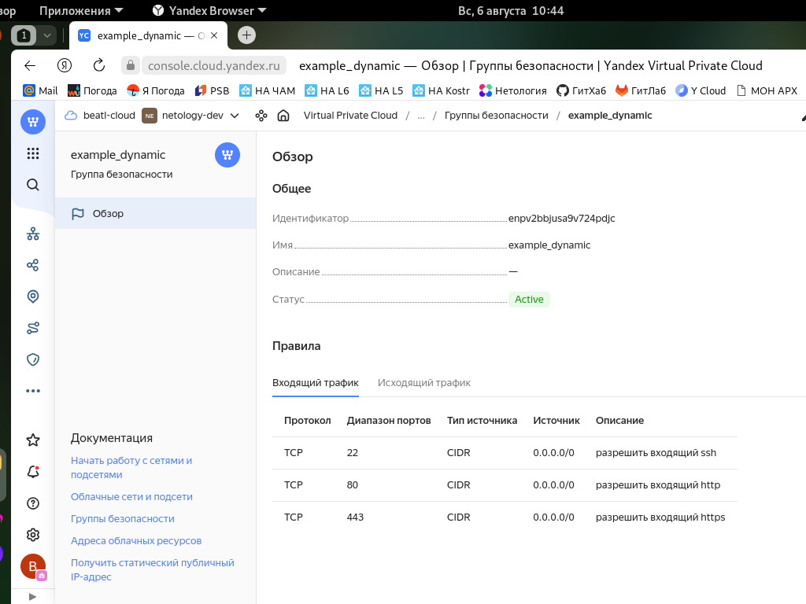
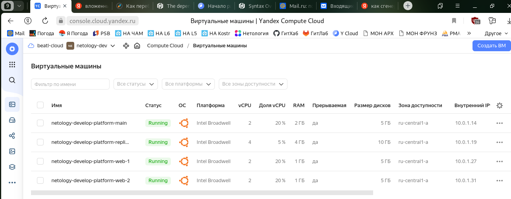

# Домашнее задание к занятию «Управляющие конструкции в коде Terraform»

-----

### Задание 1

1. Изучите проект.
2. Заполните файл personal.auto.tfvars.
3. Инициализируйте проект, выполните код. Он выполнится, даже если доступа к preview нет.

Приложите скриншот входящих правил «Группы безопасности» в ЛК Yandex Cloud или скриншот отказа в предоставлении доступа к preview-версии.

### Решение 1



------

### Задание 2

1. Создайте файл count-vm.tf. Опишите в нём создание двух **одинаковых** ВМ  web-1 и web-2 (не web-0 и web-1) с минимальными параметрами, используя мета-аргумент **count loop**. Назначьте ВМ созданную в первом задании группу безопасности.(как это сделать узнайте в документации провайдера yandex/compute_instance )
2. Создайте файл for_each-vm.tf. Опишите в нём создание двух ВМ с именами "main" и "replica" **разных** по cpu/ram/disk , используя мета-аргумент **for_each loop**. Используйте для обеих ВМ одну общую переменную типа list(object({ vm_name=string, cpu=number, ram=number, disk=number  })). При желании внесите в переменную все возможные параметры.
3. ВМ из пункта 2.2 должны создаваться после создания ВМ из пункта 2.1.
4. Используйте функцию file в local-переменной для считывания ключа ~/.ssh/id_rsa.pub и его последующего использования в блоке metadata, взятому из ДЗ 2.
5. Инициализируйте проект, выполните код.

### Решение 2

_Файл "count-vm.tf"_

```
resource "yandex_compute_instance" "my_web_vm" {
  name        = "netology-develop-platform-web-${count.index+1}"
  platform_id = "standard-v1"
  
  count = 2

  resources {
    cores  = 2
    memory = 1
    core_fraction = 20
  }

  boot_disk {
    initialize_params {
      image_id = data.yandex_compute_image.ubuntu-2004-lts.image_id
      type = "network-hdd"
      size = 5
    }   
  }

  metadata = {
    ssh-keys = local.ssh-key
  }

  scheduling_policy { preemptible = true }

  network_interface { 
    subnet_id = yandex_vpc_subnet.develop.id
    nat       = true
  }
  allow_stopping_for_update = true
}
```

_Файл "for\_each-vm.tf"_

```
resource "yandex_compute_instance" "my_spare_vm" {
  depends_on = [ yandex_compute_instance.my_web_vm ]
  for_each = var.vms_resources
  name        = "netology-develop-platform-${each.value.name}"
  platform_id = "standard-v1"

  resources {
    cores  = each.value.cores
    memory = each.value.mem
    core_fraction = each.value.core_fraction
  }

  boot_disk {
    initialize_params {
      image_id = data.yandex_compute_image.ubuntu-2004-lts.image_id
      type = "network-hdd"
      size = each.value.disk_size
    }   
  }

  metadata = {
    ssh-keys = local.ssh-key
  }

  scheduling_policy { preemptible = true }

  network_interface { 
    subnet_id = yandex_vpc_subnet.develop.id
    nat       = true
  }
  allow_stopping_for_update = true
}
```

_Файл "locals.tf"_

```
locals {
  ssh-key = "ubuntu:${file("~/.ssh/id_ed25519.pub")}"
  
  for_hosts = {
      webservers = yandex_compute_instance.my_web_vm
      databases = yandex_compute_instance.my_spare_vm
      storage = yandex_compute_instance.my_disk_vm
   }   
}
```

_Вывод terraform_

```
beatl@ProBookB:~/ter-homeworks/03/src$ terraform apply
data.yandex_compute_image.ubuntu-2004-lts: Reading...
data.yandex_compute_image.ubuntu-2004-lts: Read complete after 2s [id=fd8s1rt9rlesqptbevhg]

Terraform used the selected providers to generate the following execution plan.
Resource actions are indicated with the following symbols:
  + create

Terraform will perform the following actions:

  # yandex_compute_instance.my_spare_vm["main_resources"] will be created
  + resource "yandex_compute_instance" "my_spare_vm" {
      + allow_stopping_for_update = true
      + created_at                = (known after apply)
      + folder_id                 = (known after apply)
      + fqdn                      = (known after apply)
      + gpu_cluster_id            = (known after apply)
      + hostname                  = (known after apply)
      + id                        = (known after apply)
      + metadata                  = {
          + "ssh-keys" = <<-EOT
                ubuntu:ssh-ed25519 AAAAC3NzaC1lZDI1NTE5AAAAILroHnVVBk9mPo8RNp6OEy2yfY47sOhO4WhtixAINpNS beatl@ProBookB
            EOT
        }
      + name                      = "netology-develop-platform-web-main"
      + network_acceleration_type = "standard"
      + platform_id               = "standard-v1"
      + service_account_id        = (known after apply)
      + status                    = (known after apply)
      + zone                      = (known after apply)

      + boot_disk {
          + auto_delete = true
          + device_name = (known after apply)
          + disk_id     = (known after apply)
          + mode        = (known after apply)

          + initialize_params {
              + block_size  = (known after apply)
              + description = (known after apply)
              + image_id    = "fd8s1rt9rlesqptbevhg"
              + name        = (known after apply)
              + size        = 5
              + snapshot_id = (known after apply)
              + type        = "network-hdd"
            }
        }

      + network_interface {
          + index              = (known after apply)
          + ip_address         = (known after apply)
          + ipv4               = true
          + ipv6               = (known after apply)
          + ipv6_address       = (known after apply)
          + mac_address        = (known after apply)
          + nat                = true
          + nat_ip_address     = (known after apply)
          + nat_ip_version     = (known after apply)
          + security_group_ids = (known after apply)
          + subnet_id          = (known after apply)
        }

      + resources {
          + core_fraction = 20
          + cores         = 2
          + memory        = 2
        }

      + scheduling_policy {
          + preemptible = true
        }
    }

  # yandex_compute_instance.my_spare_vm["replica_resources"] will be created
  + resource "yandex_compute_instance" "my_spare_vm" {
      + allow_stopping_for_update = true
      + created_at                = (known after apply)
      + folder_id                 = (known after apply)
      + fqdn                      = (known after apply)
      + gpu_cluster_id            = (known after apply)
      + hostname                  = (known after apply)
      + id                        = (known after apply)
      + metadata                  = {
          + "ssh-keys" = <<-EOT
                ubuntu:ssh-ed25519 AAAAC3NzaC1lZDI1NTE5AAAAILroHnVVBk9mPo8RNp6OEy2yfY47sOhO4WhtixAINpNS beatl@ProBookB
            EOT
        }
      + name                      = "netology-develop-platform-web-replica"
      + network_acceleration_type = "standard"
      + platform_id               = "standard-v1"
      + service_account_id        = (known after apply)
      + status                    = (known after apply)
      + zone                      = (known after apply)

      + boot_disk {
          + auto_delete = true
          + device_name = (known after apply)
          + disk_id     = (known after apply)
          + mode        = (known after apply)

          + initialize_params {
              + block_size  = (known after apply)
              + description = (known after apply)
              + image_id    = "fd8s1rt9rlesqptbevhg"
              + name        = (known after apply)
              + size        = 10
              + snapshot_id = (known after apply)
              + type        = "network-hdd"
            }
        }

      + network_interface {
          + index              = (known after apply)
          + ip_address         = (known after apply)
          + ipv4               = true
          + ipv6               = (known after apply)
          + ipv6_address       = (known after apply)
          + mac_address        = (known after apply)
          + nat                = true
          + nat_ip_address     = (known after apply)
          + nat_ip_version     = (known after apply)
          + security_group_ids = (known after apply)
          + subnet_id          = (known after apply)
        }

      + resources {
          + core_fraction = 5
          + cores         = 4
          + memory        = 4
        }

      + scheduling_policy {
          + preemptible = true
        }
    }

  # yandex_compute_instance.my_web_vm[0] will be created
  + resource "yandex_compute_instance" "my_web_vm" {
      + allow_stopping_for_update = true
      + created_at                = (known after apply)
      + folder_id                 = (known after apply)
      + fqdn                      = (known after apply)
      + gpu_cluster_id            = (known after apply)
      + hostname                  = (known after apply)
      + id                        = (known after apply)
      + metadata                  = {
          + "ssh-keys" = <<-EOT
                ubuntu:ssh-ed25519 AAAAC3NzaC1lZDI1NTE5AAAAILroHnVVBk9mPo8RNp6OEy2yfY47sOhO4WhtixAINpNS beatl@ProBookB
            EOT
        }
      + name                      = "netology-develop-platform-web-1"
      + network_acceleration_type = "standard"
      + platform_id               = "standard-v1"
      + service_account_id        = (known after apply)
      + status                    = (known after apply)
      + zone                      = (known after apply)

      + boot_disk {
          + auto_delete = true
          + device_name = (known after apply)
          + disk_id     = (known after apply)
          + mode        = (known after apply)

          + initialize_params {
              + block_size  = (known after apply)
              + description = (known after apply)
              + image_id    = "fd8s1rt9rlesqptbevhg"
              + name        = (known after apply)
              + size        = 5
              + snapshot_id = (known after apply)
              + type        = "network-hdd"
            }
        }

      + network_interface {
          + index              = (known after apply)
          + ip_address         = (known after apply)
          + ipv4               = true
          + ipv6               = (known after apply)
          + ipv6_address       = (known after apply)
          + mac_address        = (known after apply)
          + nat                = true
          + nat_ip_address     = (known after apply)
          + nat_ip_version     = (known after apply)
          + security_group_ids = (known after apply)
          + subnet_id          = (known after apply)
        }

      + resources {
          + core_fraction = 20
          + cores         = 2
          + memory        = 1
        }

      + scheduling_policy {
          + preemptible = true
        }
    }

  # yandex_compute_instance.my_web_vm[1] will be created
  + resource "yandex_compute_instance" "my_web_vm" {
      + allow_stopping_for_update = true
      + created_at                = (known after apply)
      + folder_id                 = (known after apply)
      + fqdn                      = (known after apply)
      + gpu_cluster_id            = (known after apply)
      + hostname                  = (known after apply)
      + id                        = (known after apply)
      + metadata                  = {
          + "ssh-keys" = <<-EOT
                ubuntu:ssh-ed25519 AAAAC3NzaC1lZDI1NTE5AAAAILroHnVVBk9mPo8RNp6OEy2yfY47sOhO4WhtixAINpNS beatl@ProBookB
            EOT
        }
      + name                      = "netology-develop-platform-web-2"
      + network_acceleration_type = "standard"
      + platform_id               = "standard-v1"
      + service_account_id        = (known after apply)
      + status                    = (known after apply)
      + zone                      = (known after apply)

      + boot_disk {
          + auto_delete = true
          + device_name = (known after apply)
          + disk_id     = (known after apply)
          + mode        = (known after apply)

          + initialize_params {
              + block_size  = (known after apply)
              + description = (known after apply)
              + image_id    = "fd8s1rt9rlesqptbevhg"
              + name        = (known after apply)
              + size        = 5
              + snapshot_id = (known after apply)
              + type        = "network-hdd"
            }
        }

      + network_interface {
          + index              = (known after apply)
          + ip_address         = (known after apply)
          + ipv4               = true
          + ipv6               = (known after apply)
          + ipv6_address       = (known after apply)
          + mac_address        = (known after apply)
          + nat                = true
          + nat_ip_address     = (known after apply)
          + nat_ip_version     = (known after apply)
          + security_group_ids = (known after apply)
          + subnet_id          = (known after apply)
        }

      + resources {
          + core_fraction = 20
          + cores         = 2
          + memory        = 1
        }

      + scheduling_policy {
          + preemptible = true
        }
    }

  # yandex_vpc_network.develop will be created
  + resource "yandex_vpc_network" "develop" {
      + created_at                = (known after apply)
      + default_security_group_id = (known after apply)
      + folder_id                 = (known after apply)
      + id                        = (known after apply)
      + labels                    = (known after apply)
      + name                      = "develop"
      + subnet_ids                = (known after apply)
    }

  # yandex_vpc_security_group.my_sec_grp will be created
  + resource "yandex_vpc_security_group" "my_sec_grp" {
      + created_at = (known after apply)
      + folder_id  = "b1ggopu0i05k9eac2102"
      + id         = (known after apply)
      + labels     = (known after apply)
      + name       = "example_dynamic"
      + network_id = (known after apply)
      + status     = (known after apply)

      + egress {
          + description    = "разрешить весь исходящий трафик"
          + from_port      = 0
          + id             = (known after apply)
          + labels         = (known after apply)
          + port           = -1
          + protocol       = "TCP"
          + to_port        = 65365
          + v4_cidr_blocks = [
              + "0.0.0.0/0",
            ]
          + v6_cidr_blocks = []
        }

      + ingress {
          + description    = "разрешить входящий  http"
          + from_port      = -1
          + id             = (known after apply)
          + labels         = (known after apply)
          + port           = 80
          + protocol       = "TCP"
          + to_port        = -1
          + v4_cidr_blocks = [
              + "0.0.0.0/0",
            ]
          + v6_cidr_blocks = []
        }
      + ingress {
          + description    = "разрешить входящий https"
          + from_port      = -1
          + id             = (known after apply)
          + labels         = (known after apply)
          + port           = 443
          + protocol       = "TCP"
          + to_port        = -1
          + v4_cidr_blocks = [
              + "0.0.0.0/0",
            ]
          + v6_cidr_blocks = []
        }
      + ingress {
          + description    = "разрешить входящий ssh"
          + from_port      = -1
          + id             = (known after apply)
          + labels         = (known after apply)
          + port           = 22
          + protocol       = "TCP"
          + to_port        = -1
          + v4_cidr_blocks = [
              + "0.0.0.0/0",
            ]
          + v6_cidr_blocks = []
        }
    }

  # yandex_vpc_subnet.develop will be created
  + resource "yandex_vpc_subnet" "develop" {
      + created_at     = (known after apply)
      + folder_id      = (known after apply)
      + id             = (known after apply)
      + labels         = (known after apply)
      + name           = "develop"
      + network_id     = (known after apply)
      + v4_cidr_blocks = [
          + "10.0.1.0/24",
        ]
      + v6_cidr_blocks = (known after apply)
      + zone           = "ru-central1-a"
    }

Plan: 7 to add, 0 to change, 0 to destroy.

Do you want to perform these actions?
  Terraform will perform the actions described above.
  Only 'yes' will be accepted to approve.

  Enter a value: yes

yandex_vpc_network.develop: Creating...
yandex_vpc_network.develop: Creation complete after 3s [id=enpr3jk5j0ecg7n4h1fs]
yandex_vpc_subnet.develop: Creating...
yandex_vpc_security_group.my_sec_grp: Creating...
yandex_vpc_subnet.develop: Creation complete after 1s [id=e9bf1m84ng7dln79hfgk]
yandex_compute_instance.my_web_vm[1]: Creating...
yandex_compute_instance.my_web_vm[0]: Creating...
yandex_vpc_security_group.my_sec_grp: Creation complete after 1s [id=enp9taf6i2bfc7bvhpk5]
yandex_compute_instance.my_web_vm[0]: Still creating... [10s elapsed]
yandex_compute_instance.my_web_vm[1]: Still creating... [10s elapsed]
yandex_compute_instance.my_web_vm[1]: Still creating... [20s elapsed]
yandex_compute_instance.my_web_vm[0]: Still creating... [20s elapsed]
yandex_compute_instance.my_web_vm[0]: Still creating... [30s elapsed]
yandex_compute_instance.my_web_vm[1]: Still creating... [30s elapsed]
yandex_compute_instance.my_web_vm[0]: Still creating... [40s elapsed]
yandex_compute_instance.my_web_vm[1]: Still creating... [40s elapsed]
yandex_compute_instance.my_web_vm[1]: Creation complete after 42s [id=fhm4vpimqisc6cvrft0j]
yandex_compute_instance.my_web_vm[0]: Creation complete after 46s [id=fhm8g9ckvpidpocsvjtg]
yandex_compute_instance.my_spare_vm["replica_resources"]: Creating...
yandex_compute_instance.my_spare_vm["main_resources"]: Creating...
yandex_compute_instance.my_spare_vm["replica_resources"]: Still creating... [10s elapsed]
yandex_compute_instance.my_spare_vm["main_resources"]: Still creating... [10s elapsed]
yandex_compute_instance.my_spare_vm["replica_resources"]: Still creating... [20s elapsed]
yandex_compute_instance.my_spare_vm["main_resources"]: Still creating... [20s elapsed]
yandex_compute_instance.my_spare_vm["replica_resources"]: Still creating... [30s elapsed]
yandex_compute_instance.my_spare_vm["main_resources"]: Still creating... [30s elapsed]
yandex_compute_instance.my_spare_vm["replica_resources"]: Creation complete after 35s [id=fhmkd7rp7b01sdnk1vjr]
yandex_compute_instance.my_spare_vm["main_resources"]: Creation complete after 39s [id=fhm8j2o75gptf4i53upv]

Apply complete! Resources: 7 added, 0 changed, 0 destroyed.
```



------

### Задание 3

1. Создайте 3 одинаковых виртуальных диска размером 1 Гб с помощью ресурса yandex_compute_disk и мета-аргумента count в файле **disk_vm.tf** .
2. Создайте в том же файле одну ВМ c именем "storage" . Используйте блок **dynamic secondary_disk{..}** и мета-аргумент for_each для подключения созданных вами дополнительных дисков.

### Решение 3

_Файл "disk\_vm.tf"_

```
resource "yandex_compute_disk" "my_disks" {
  count      = 3
  name       = "empty-disk-${count.index+1}"
  type       = "network-hdd"
  zone       = var.default_zone
  size       = 1
}

resource "yandex_compute_instance" "my_disk_vm" {
  name        = "netology-develop-platform-disk-vm"
  platform_id = "standard-v1"
  
  resources {
    cores  = 2
    memory = 1
    core_fraction = 20
  }

  boot_disk {
    initialize_params {
      image_id = data.yandex_compute_image.ubuntu-2004-lts.image_id
      type = "network-hdd"
      size = 5
    } 
  }  
  dynamic "secondary_disk" {
    for_each = yandex_compute_disk.my_disks
    content {
      disk_id = secondary_disk.value.id
      auto_delete = true 
    }    
  }  
    metadata = {
    ssh-keys = local.ssh-key
  }

  scheduling_policy { preemptible = true }

  network_interface { 
    subnet_id = yandex_vpc_subnet.develop.id
    nat       = true
  }
  allow_stopping_for_update = true
}
```
_Вывод terraform_

```
beatl@ProBookB:~/ter-homeworks/03/src$ terraform apply
data.yandex_compute_image.ubuntu-2004-lts: Reading...
yandex_vpc_network.develop: Refreshing state... [id=enpq7vt0enfe1353ah14]
data.yandex_compute_image.ubuntu-2004-lts: Read complete after 2s [id=fd8s1rt9rlesqptbevhg]
yandex_vpc_subnet.develop: Refreshing state... [id=e9bohnu0vv2jvir9gs13]
yandex_vpc_security_group.my_sec_grp: Refreshing state... [id=enp515eg0rpc41d6s8ni]
yandex_compute_instance.my_web_vm[0]: Refreshing state... [id=fhmds45enotlds50vspf]
yandex_compute_instance.my_web_vm[1]: Refreshing state... [id=fhmqn7sldus06556jidc]
yandex_compute_instance.my_spare_vm["replica_resources"]: Refreshing state... [id=fhm626dso9kcum8vbj77]
yandex_compute_instance.my_spare_vm["main_resources"]: Refreshing state... [id=fhm0s9vr1im9r5hu8bj8]

Terraform used the selected providers to generate the following execution plan.
Resource actions are indicated with the following symbols:
  + create

Terraform will perform the following actions:

  # yandex_compute_disk.my_disks[0] will be created
  + resource "yandex_compute_disk" "my_disks" {
      + block_size  = 4096
      + created_at  = (known after apply)
      + folder_id   = (known after apply)
      + id          = (known after apply)
      + name        = "empty-disk-1"
      + product_ids = (known after apply)
      + size        = 1
      + status      = (known after apply)
      + type        = "network-hdd"
      + zone        = "ru-central1-a"
    }

  # yandex_compute_disk.my_disks[1] will be created
  + resource "yandex_compute_disk" "my_disks" {
      + block_size  = 4096
      + created_at  = (known after apply)
      + folder_id   = (known after apply)
      + id          = (known after apply)
      + name        = "empty-disk-2"
      + product_ids = (known after apply)
      + size        = 1
      + status      = (known after apply)
      + type        = "network-hdd"
      + zone        = "ru-central1-a"
    }

  # yandex_compute_disk.my_disks[2] will be created
  + resource "yandex_compute_disk" "my_disks" {
      + block_size  = 4096
      + created_at  = (known after apply)
      + folder_id   = (known after apply)
      + id          = (known after apply)
      + name        = "empty-disk-3"
      + product_ids = (known after apply)
      + size        = 1
      + status      = (known after apply)
      + type        = "network-hdd"
      + zone        = "ru-central1-a"
    }

  # yandex_compute_instance.my_disk_vm will be created
  + resource "yandex_compute_instance" "my_disk_vm" {
      + allow_stopping_for_update = true
      + created_at                = (known after apply)
      + folder_id                 = (known after apply)
      + fqdn                      = (known after apply)
      + gpu_cluster_id            = (known after apply)
      + hostname                  = (known after apply)
      + id                        = (known after apply)
      + metadata                  = {
          + "ssh-keys" = <<-EOT
                ubuntu:ssh-ed25519 AAAAC3NzaC1lZDI1NTE5AAAAILroHnVVBk9mPo8RNp6OEy2yfY47sOhO4WhtixAINpNS beatl@ProBookB
            EOT
        }
      + name                      = "netology-develop-platform-disk-vm"
      + network_acceleration_type = "standard"
      + platform_id               = "standard-v1"
      + service_account_id        = (known after apply)
      + status                    = (known after apply)
      + zone                      = (known after apply)

      + boot_disk {
          + auto_delete = true
          + device_name = (known after apply)
          + disk_id     = (known after apply)
          + mode        = (known after apply)

          + initialize_params {
              + block_size  = (known after apply)
              + description = (known after apply)
              + image_id    = "fd8s1rt9rlesqptbevhg"
              + name        = (known after apply)
              + size        = 5
              + snapshot_id = (known after apply)
              + type        = "network-hdd"
            }
        }

      + network_interface {
          + index              = (known after apply)
          + ip_address         = (known after apply)
          + ipv4               = true
          + ipv6               = (known after apply)
          + ipv6_address       = (known after apply)
          + mac_address        = (known after apply)
          + nat                = true
          + nat_ip_address     = (known after apply)
          + nat_ip_version     = (known after apply)
          + security_group_ids = (known after apply)
          + subnet_id          = "e9bohnu0vv2jvir9gs13"
        }

      + resources {
          + core_fraction = 20
          + cores         = 2
          + memory        = 1
        }

      + scheduling_policy {
          + preemptible = true
        }

      + secondary_disk {
          + auto_delete = true
          + device_name = (known after apply)
          + disk_id     = (known after apply)
          + mode        = "READ_WRITE"
        }
      + secondary_disk {
          + auto_delete = true
          + device_name = (known after apply)
          + disk_id     = (known after apply)
          + mode        = "READ_WRITE"
        }
      + secondary_disk {
          + auto_delete = true
          + device_name = (known after apply)
          + disk_id     = (known after apply)
          + mode        = "READ_WRITE"
        }
    }

Plan: 4 to add, 0 to change, 0 to destroy.

Do you want to perform these actions?
  Terraform will perform the actions described above.
  Only 'yes' will be accepted to approve.

  Enter a value: yes

yandex_compute_disk.my_disks[1]: Creating...
yandex_compute_disk.my_disks[0]: Creating...
yandex_compute_disk.my_disks[2]: Creating...
yandex_compute_disk.my_disks[2]: Still creating... [10s elapsed]
yandex_compute_disk.my_disks[1]: Still creating... [10s elapsed]
yandex_compute_disk.my_disks[0]: Still creating... [10s elapsed]
yandex_compute_disk.my_disks[2]: Creation complete after 11s [id=fhmr4f8e5i6032kca3mv]
yandex_compute_disk.my_disks[1]: Creation complete after 13s [id=fhm8pr7iacj0uuc4aiuq]
yandex_compute_disk.my_disks[0]: Creation complete after 13s [id=fhm3l3jfd79oaa332mrv]
yandex_compute_instance.my_disk_vm: Creating...
yandex_compute_instance.my_disk_vm: Still creating... [10s elapsed]
yandex_compute_instance.my_disk_vm: Still creating... [20s elapsed]
yandex_compute_instance.my_disk_vm: Still creating... [30s elapsed]
yandex_compute_instance.my_disk_vm: Creation complete after 35s [id=fhmab5elrakqc0n97d5n]

Apply complete! Resources: 4 added, 0 changed, 0 destroyed.
```

------

### Задание 4

1. В файле ansible.tf создайте inventory-файл для ansible.
Используйте функцию tepmplatefile и файл-шаблон для создания ansible inventory-файла из лекции.
Готовый код возьмите из демонстрации к лекции [**demonstration2**](https://github.com/netology-code/ter-homeworks/tree/main/demonstration2).
Передайте в него в качестве переменных группы виртуальных машин из задания 2.1, 2.2 и 3.2, т. е. 5 ВМ.
2. Инвентарь должен содержать 3 группы [webservers], [databases], [storage] и быть динамическим, т. е. обработать как группу из 2-х ВМ, так и 999 ВМ.
4. Выполните код. Приложите скриншот получившегося файла. 

### Решение 4

_Файл "ansible.tf"_

```
resource "local_file" "hosts_cfg" {
  content = templatefile("${path.module}/hosts.tftpl", 
  {
    config = {
      webservers =  yandex_compute_instance.my_web_vm
      databases = yandex_compute_instance.my_spare_vm 
      storage = [yandex_compute_instance.my_disk_vm]
    }
  })
  filename = "${abspath(path.module)}/hosts.cfg"
}

resource "null_resource" "web_hosts_provision" {
#Ждем создания инстанса
depends_on = [yandex_compute_instance.my_web_vm,yandex_compute_instance.my_spare_vm,yandex_compute_instance.my_disk_vm]

#Добавление ПРИВАТНОГО ssh ключа в ssh-agent
  provisioner "local-exec" {
    command = "cat ~/.ssh/id_ed25519  | ssh-add -"
  }

#Костыль!!! Даем ВМ 60 сек на первый запуск. Лучше выполнить это через wait_for port 22 на стороне ansible
# В случае использования cloud-init может потребоваться еще больше времени
  provisioner "local-exec" {
    command = "sleep 60"
  }

#Запуск ansible-playbook
  provisioner "local-exec" {                  
    command  = "export ANSIBLE_HOST_KEY_CHECKING=False; ansible-playbook -i ${abspath(path.module)}/hosts.cfg ${abspath(path.module)}/test.yml"
    on_failure = continue #Продолжить выполнение terraform pipeline в случае ошибок
    environment = { ANSIBLE_HOST_KEY_CHECKING = "False" }
    #срабатывание триггера при изменении переменных
  }
    triggers = {  
      always_run         = "${timestamp()}" #всегда т.к. дата и время постоянно изменяются
      playbook_src_hash  = file("${abspath(path.module)}/test.yml") # при изменении содержимого playbook файла
      ssh_public_key     = local.ssh-key # при изменении переменной
    }
}
```

_Файл "hosts.tftpl"_

```
%{~ for k,v in config ~}
[${k}]
  %{~ for i in v ~}
    ${i["name"]}   ansible_host=${i["network_interface"][0]["nat_ip_address"]}
  %{~ endfor ~}
%{~ endfor ~}
```

_Вывод terraform_

```
beatl@ProBookB:~/ter-homeworks/03/src$ terraform apply
data.yandex_compute_image.ubuntu-2004-lts: Reading...
yandex_vpc_network.develop: Refreshing state... [id=enp0fajqnk230vmqntd1]
yandex_compute_disk.my_disks[0]: Refreshing state... [id=fhmhfj0462e06k3aket8]
yandex_compute_disk.my_disks[1]: Refreshing state... [id=fhmb1eosv7j5o55bqh3i]
yandex_compute_disk.my_disks[2]: Refreshing state... [id=fhmtpgi0nqrer8ogv24e]
data.yandex_compute_image.ubuntu-2004-lts: Read complete after 3s [id=fd8h5v894psivbl4t2dn]
yandex_vpc_subnet.develop: Refreshing state... [id=e9brvpvllh9uvnrhc9r6]
yandex_vpc_security_group.my_sec_grp: Refreshing state... [id=enp733f3fmrpj2rharcl]
yandex_compute_instance.my_web_vm[0]: Refreshing state... [id=fhm849agjjjmcikfup8f]
yandex_compute_instance.my_web_vm[1]: Refreshing state... [id=fhms67hkmh2ammtsh0eh]
yandex_compute_instance.my_disk_vm: Refreshing state... [id=fhm1mgjcnvq8dhmn2p2k]
yandex_compute_instance.my_spare_vm["replica_resources"]: Refreshing state... [id=fhmkpbh4qmbeqbce8oos]
yandex_compute_instance.my_spare_vm["main_resources"]: Refreshing state... [id=fhm0c1b5nrfgjhnvqat5]
null_resource.web_hosts_provision: Refreshing state... [id=4858883847409331897]
local_file.hosts_cfg: Refreshing state... [id=10f55b30ba308d03f45169d058c27c016cc80625]

Terraform used the selected providers to generate the following execution plan. Resource actions are indicated with the following
symbols:
-/+ destroy and then create replacement

Terraform will perform the following actions:

  # null_resource.web_hosts_provision must be replaced
-/+ resource "null_resource" "web_hosts_provision" {
      ~ id       = "4858883847409331897" -> (known after apply)
      ~ triggers = { # forces replacement
          ~ "always_run"        = "2023-08-07T18:29:10Z" -> (known after apply)
          ~ "playbook_src_hash" = <<-EOT
                ---
                
                - name: test
                  gather_facts: false
                  hosts: all
                  vars:
                    ansible_user: ubuntu
                  become: yes
                  become_user: root
                  remote_user: ubuntu
                  tasks:
                  - name: Create directory for ssh-keys
                    file: state=directory mode=0700 dest=/root/.ssh/
                
                  - name: Adding rsa-key in /root/.ssh/authorized_keys
                    copy: src=~/.ssh/id_ed25519.pub dest=/root/.ssh/authorized_keys owner=root mode=0600
                    ignore_errors: yes
              - #  - name: "Ansible | List all known variables and facts"
              - #    debug:
              - #      var: hostvars[inventory_hostname]  
              -   - name: Wait for server 
              -     local_action:
              -       module: wait_for
              -         host={{ inventory_hostname }}
              -         port=22
              -         delay=10
              -     become: true
                  - name: Install Nginx Web Server on Debian Family
                    apt:
                      name: nginx
                      state: latest   
                      update_cache: yes
            EOT
            # (1 unchanged element hidden)
        }
    }

Plan: 1 to add, 0 to change, 1 to destroy.

Do you want to perform these actions?
  Terraform will perform the actions described above.
  Only 'yes' will be accepted to approve.

  Enter a value: yes

null_resource.web_hosts_provision: Destroying... [id=4858883847409331897]
null_resource.web_hosts_provision: Destruction complete after 0s
null_resource.web_hosts_provision: Creating...
null_resource.web_hosts_provision: Provisioning with 'local-exec'...
null_resource.web_hosts_provision (local-exec): Executing: ["/bin/sh" "-c" "cat ~/.ssh/id_ed25519  | ssh-add -"]
null_resource.web_hosts_provision (local-exec): Identity added: (stdin) (beatl@ProBookB)
null_resource.web_hosts_provision: Provisioning with 'local-exec'...
null_resource.web_hosts_provision (local-exec): Executing: ["/bin/sh" "-c" "sleep 60"]
null_resource.web_hosts_provision: Still creating... [10s elapsed]
null_resource.web_hosts_provision: Still creating... [20s elapsed]
null_resource.web_hosts_provision: Still creating... [30s elapsed]
null_resource.web_hosts_provision: Still creating... [40s elapsed]
null_resource.web_hosts_provision: Still creating... [50s elapsed]
null_resource.web_hosts_provision: Still creating... [1m0s elapsed]
null_resource.web_hosts_provision: Provisioning with 'local-exec'...
null_resource.web_hosts_provision (local-exec): Executing: ["/bin/sh" "-c" "export ANSIBLE_HOST_KEY_CHECKING=False; ansible-playbook -i /home/beatl/ter-homeworks/03/src/hosts.cfg /home/beatl/ter-homeworks/03/src/test.yml"]

null_resource.web_hosts_provision (local-exec): PLAY [test] ********************************************************************

null_resource.web_hosts_provision (local-exec): TASK [Create directory for ssh-keys] *******************************************
null_resource.web_hosts_provision (local-exec): ok: [netology-develop-platform-web-1]
null_resource.web_hosts_provision (local-exec): ok: [netology-develop-platform-replica]
null_resource.web_hosts_provision (local-exec): ok: [netology-develop-platform-disk-vm]
null_resource.web_hosts_provision (local-exec): ok: [netology-develop-platform-web-2]
null_resource.web_hosts_provision (local-exec): ok: [netology-develop-platform-main]

null_resource.web_hosts_provision (local-exec): TASK [Adding rsa-key in /root/.ssh/authorized_keys] ****************************
null_resource.web_hosts_provision: Still creating... [1m10s elapsed]
null_resource.web_hosts_provision (local-exec): ok: [netology-develop-platform-web-2]
null_resource.web_hosts_provision (local-exec): ok: [netology-develop-platform-web-1]
null_resource.web_hosts_provision (local-exec): ok: [netology-develop-platform-disk-vm]
null_resource.web_hosts_provision (local-exec): ok: [netology-develop-platform-main]
null_resource.web_hosts_provision (local-exec): ok: [netology-develop-platform-replica]

null_resource.web_hosts_provision (local-exec): TASK [Install Nginx Web Server on Debian Family] *******************************
null_resource.web_hosts_provision (local-exec): ok: [netology-develop-platform-web-1]
null_resource.web_hosts_provision (local-exec): ok: [netology-develop-platform-web-2]
null_resource.web_hosts_provision (local-exec): ok: [netology-develop-platform-disk-vm]
null_resource.web_hosts_provision (local-exec): ok: [netology-develop-platform-main]
null_resource.web_hosts_provision (local-exec): ok: [netology-develop-platform-replica]

null_resource.web_hosts_provision (local-exec): PLAY RECAP *********************************************************************
null_resource.web_hosts_provision (local-exec): netology-develop-platform-disk-vm : ok=3    changed=0    unreachable=0    failed=0    skipped=0    rescued=0    ignored=0
null_resource.web_hosts_provision (local-exec): netology-develop-platform-main : ok=3    changed=0    unreachable=0    failed=0    skipped=0    rescued=0    ignored=0
null_resource.web_hosts_provision (local-exec): netology-develop-platform-replica : ok=3    changed=0    unreachable=0    failed=0    skipped=0    rescued=0    ignored=0
null_resource.web_hosts_provision (local-exec): netology-develop-platform-web-1 : ok=3    changed=0    unreachable=0    failed=0    skipped=0    rescued=0    ignored=0
null_resource.web_hosts_provision (local-exec): netology-develop-platform-web-2 : ok=3    changed=0    unreachable=0    failed=0    skipped=0    rescued=0    ignored=0

null_resource.web_hosts_provision: Creation complete after 1m18s [id=317418686109102008]

Apply complete! Resources: 1 added, 0 changed, 1 destroyed.
```

**Удалите все созданные ресурсы**.

```
      ---- skip ----
      
Plan: 0 to add, 0 to change, 13 to destroy.

Do you really want to destroy all resources?
  Terraform will destroy all your managed infrastructure, as shown above.
  There is no undo. Only 'yes' will be accepted to confirm.

  Enter a value: yes

null_resource.web_hosts_provision: Destroying... [id=317418686109102008]
null_resource.web_hosts_provision: Destruction complete after 0s
local_file.hosts_cfg: Destroying... [id=10f55b30ba308d03f45169d058c27c016cc80625]
local_file.hosts_cfg: Destruction complete after 0s
yandex_compute_instance.my_spare_vm["main_resources"]: Destroying... [id=fhm0c1b5nrfgjhnvqat5]
yandex_compute_instance.my_spare_vm["replica_resources"]: Destroying... [id=fhmkpbh4qmbeqbce8oos]
yandex_compute_instance.my_disk_vm: Destroying... [id=fhm1mgjcnvq8dhmn2p2k]
yandex_vpc_security_group.my_sec_grp: Destroying... [id=enp733f3fmrpj2rharcl]
yandex_vpc_security_group.my_sec_grp: Destruction complete after 3s
yandex_compute_instance.my_spare_vm["main_resources"]: Still destroying... [id=fhm0c1b5nrfgjhnvqat5, 10s elapsed]
yandex_compute_instance.my_spare_vm["replica_resources"]: Still destroying... [id=fhmkpbh4qmbeqbce8oos, 10s elapsed]
yandex_compute_instance.my_disk_vm: Still destroying... [id=fhm1mgjcnvq8dhmn2p2k, 10s elapsed]
yandex_compute_instance.my_spare_vm["main_resources"]: Still destroying... [id=fhm0c1b5nrfgjhnvqat5, 20s elapsed]
yandex_compute_instance.my_spare_vm["replica_resources"]: Still destroying... [id=fhmkpbh4qmbeqbce8oos, 20s elapsed]
yandex_compute_instance.my_disk_vm: Still destroying... [id=fhm1mgjcnvq8dhmn2p2k, 20s elapsed]
yandex_compute_instance.my_disk_vm: Destruction complete after 22s
yandex_compute_disk.my_disks[1]: Destroying... [id=fhmb1eosv7j5o55bqh3i]
yandex_compute_disk.my_disks[2]: Destroying... [id=fhmtpgi0nqrer8ogv24e]
yandex_compute_disk.my_disks[0]: Destroying... [id=fhmhfj0462e06k3aket8]
yandex_compute_disk.my_disks[2]: Destruction complete after 0s
yandex_compute_disk.my_disks[0]: Destruction complete after 0s
yandex_compute_disk.my_disks[1]: Destruction complete after 1s
yandex_compute_instance.my_spare_vm["main_resources"]: Destruction complete after 23s
yandex_compute_instance.my_spare_vm["replica_resources"]: Destruction complete after 26s
yandex_compute_instance.my_web_vm[0]: Destroying... [id=fhm849agjjjmcikfup8f]
yandex_compute_instance.my_web_vm[1]: Destroying... [id=fhms67hkmh2ammtsh0eh]
yandex_compute_instance.my_web_vm[0]: Still destroying... [id=fhm849agjjjmcikfup8f, 10s elapsed]
yandex_compute_instance.my_web_vm[1]: Still destroying... [id=fhms67hkmh2ammtsh0eh, 10s elapsed]
yandex_compute_instance.my_web_vm[1]: Destruction complete after 20s
yandex_compute_instance.my_web_vm[0]: Still destroying... [id=fhm849agjjjmcikfup8f, 20s elapsed]
yandex_compute_instance.my_web_vm[0]: Destruction complete after 25s
yandex_vpc_subnet.develop: Destroying... [id=e9brvpvllh9uvnrhc9r6]
yandex_vpc_subnet.develop: Destruction complete after 2s
yandex_vpc_network.develop: Destroying... [id=enp0fajqnk230vmqntd1]
yandex_vpc_network.develop: Destruction complete after 1s

Destroy complete! Resources: 13 destroyed.
```

------


### Задание 5* (необязательное)
1. Напишите output, который отобразит все 5 созданных ВМ в виде списка словарей:

``` 
[
 {
  "name" = 'имя ВМ1'
  "id"   = 'идентификатор ВМ1'
  "fqdn" = 'Внутренний FQDN ВМ1'
 },
 {
  "name" = 'имя ВМ2'
  "id"   = 'идентификатор ВМ2'
  "fqdn" = 'Внутренний FQDN ВМ2'
 },
 ....
]
```

### Решение 5

_Файл "output.tf"_

```
locals {
 
  res-list = [yandex_compute_instance.my_web_vm,yandex_compute_instance.my_spare_vm,[yandex_compute_instance.my_disk_vm]]
 
  vm-list = flatten([
    for k, v in local.res-list : [
      for kk, vv in v : {
        name = vv.name
        id = vv.id
        fqdn = vv.fqdn
      }
    ]  
  ])
}

output vm-list {
  value = local.vm-list
}
```

Cкриншот вывода команды terrafrom output.

```
                ----- Skip -----

Apply complete! Resources: 13 added, 0 changed, 0 destroyed.

Outputs:

vm-list = [
  {
    "fqdn" = "fhmjp7ccv7cmeqi8tjao.auto.internal"
    "id" = "fhmjp7ccv7cmeqi8tjao"
    "name" = "netology-develop-platform-web-1"
  },
  {
    "fqdn" = "fhmh8tpug3pk41gu3sm2.auto.internal"
    "id" = "fhmh8tpug3pk41gu3sm2"
    "name" = "netology-develop-platform-web-2"
  },
  {
    "fqdn" = "fhmvpu3oa9lon69l4ic4.auto.internal"
    "id" = "fhmvpu3oa9lon69l4ic4"
    "name" = "netology-develop-platform-main"
  },
  {
    "fqdn" = "fhmchbqo4vv3ola0fn3r.auto.internal"
    "id" = "fhmchbqo4vv3ola0fn3r"
    "name" = "netology-develop-platform-replica"
  },
  {
    "fqdn" = "fhm8lc9b9muu6laq1t51.auto.internal"
    "id" = "fhm8lc9b9muu6laq1t51"
    "name" = "netology-develop-platform-disk-vm"
  },
]
```

------


