# Домашнее задание к занятию «Продвинутые методы работы с Terraform»

------

### Задание 1

1. Возьмите из [демонстрации к лекции готовый код](https://github.com/netology-code/ter-homeworks/tree/main/04/demonstration1) для создания ВМ с помощью remote-модуля.
2. Создайте одну ВМ, используя этот модуль. В файле cloud-init.yml необходимо использовать переменную для ssh-ключа вместо хардкода. Передайте ssh-ключ в функцию template_file в блоке vars ={} .
Воспользуйтесь [**примером**](https://grantorchard.com/dynamic-cloudinit-content-with-terraform-file-templates/). Обратите внимание, что ssh-authorized-keys принимает в себя список, а не строку.
3. Добавьте в файл cloud-init.yml установку nginx.
4. Предоставьте скриншот подключения к консоли и вывод команды ```sudo nginx -t```.

### Решение 1

```bash
Apply complete! Resources: 3 added, 0 changed, 0 destroyed.
beatl@OWEN:~/ter-homeworks/04/src$ ssh ubuntu@51.250.66.161
The authenticity of host '51.250.66.161 (51.250.66.161)' can't be established.
ECDSA key fingerprint is SHA256:N4nbCB00QZ3vhkGG17WX4Aj4Cc+WaYV+K0InXuycXtg.
Are you sure you want to continue connecting (yes/no)? yes
Warning: Permanently added '51.250.66.161' (ECDSA) to the list of known hosts.
Welcome to Ubuntu 20.04.6 LTS (GNU/Linux 5.4.0-155-generic x86_64)

 * Documentation:  https://help.ubuntu.com
 * Management:     https://landscape.canonical.com
 * Support:        https://ubuntu.com/advantage

The programs included with the Ubuntu system are free software;
the exact distribution terms for each program are described in the
individual files in /usr/share/doc/*/copyright.

Ubuntu comes with ABSOLUTELY NO WARRANTY, to the extent permitted by
applicable law.

To run a command as administrator (user "root"), use "sudo <command>".
See "man sudo_root" for details.

ubuntu@develop-web-0:~$ sudo nginx -t
nginx: the configuration file /etc/nginx/nginx.conf syntax is ok
nginx: configuration file /etc/nginx/nginx.conf test is successful
```

------

### Задание 2

1. Напишите локальный модуль vpc, который будет создавать 2 ресурса: **одну** сеть и **одну** подсеть в зоне, объявленной при вызове модуля, например: ```ru-central1-a```.
2. Вы должны передать в модуль переменные с названием сети, zone и v4_cidr_blocks.
3. Модуль должен возвращать в root module с помощью output информацию о yandex_vpc_subnet. Пришлите скриншот информации из terraform console о своем модуле. Пример: > module.vpc_dev  
4. Замените ресурсы yandex_vpc_network и yandex_vpc_subnet созданным модулем. Не забудьте передать необходимые параметры сети из модуля vpc в модуль с виртуальной машиной.
5. Откройте terraform console и предоставьте скриншот содержимого модуля. Пример: > module.vpc_dev.
6. Сгенерируйте документацию к модулю с помощью terraform-docs.    
 
### Решение 2

_Вывод "terraform apply" после создания локального модуля в каталоге ./modules/my_vpc_module_

```
beatl@OWEN:~/ter-homeworks/04/src$ terraform apply
data.template_file.cloudinit: Reading...
data.template_file.cloudinit: Read complete after 0s [id=2175bfbf9af81ecd46011631b4b2b388e8657a11c2f0f1a34a1394348f758d6c]
module.test-vm.data.yandex_compute_image.my_image: Reading...
module.test-vm.data.yandex_compute_image.my_image: Read complete after 2s [id=fd8h5v894psivbl4t2dn]

Terraform used the selected providers to generate the following execution plan. Resource actions are indicated with the following symbols:
  + create

Terraform will perform the following actions:

  # module.test-vm.yandex_compute_instance.vm[0] will be created
  + resource "yandex_compute_instance" "vm" {
      + allow_stopping_for_update = true
      + created_at                = (known after apply)
      + description               = "TODO: description; {{terraform managed}}"
      + folder_id                 = (known after apply)
      + fqdn                      = (known after apply)
      + gpu_cluster_id            = (known after apply)
      + hostname                  = "develop-web-0"
      + id                        = (known after apply)
      + labels                    = {
          + "env"     = "develop"
          + "project" = "undefined"
        }
      + metadata                  = {
          + "serial-port-enable" = "1"
          + "user-data"          = <<-EOT
                #cloud-config
                users:
                  - name: ubuntu
                    groups: sudo
                    shell: /bin/bash
                    sudo: ['ALL=(ALL) NOPASSWD:ALL']
                    ssh_authorized_keys:
                      - "ssh-ed25519 AAAAC3NzaC1lZDI1NTE5AAAAIFzIYA9F1G3dSQ6Ngnk+XSFESJgTn1Rx4ghJ0wv6WSvN beatl@OWEN
                "
                      - "ssh-rsa AAAAB3NzaC1yc2EAAAADAQABAAABAQDHbFc6RZrHBcMDI9EL2AcC+c0mABZpTFNUer7EMslDZv/bC+H6b+rk9GwoTzhyOHss6gFcGXcTDbOi8x11esEcBGbfI/n6IUuxqaVOwrDKHM2JRxwfbWFVyiF4HUHBdN2EIUqZoBHV4qH/ajAtiWfrg5ZRwp1n0izY9GfghcS268A8nq+CoJwP54rIbEqN5rGRCulFUVIX3qKsv1zixSsoH5mJf/cLsa80FoD+SXU/H+W/bATqjG6DFRyWkBbmeV9E8CcGI7//8ATdQ8//Iy23Yq7ndQpVKd0PubQp+pDctHEr2eyfCtTzDuNArK7J/xTfyjg8nwToXONrF3gZlyG9 beatl@OWEN
                "
                package_update: true
                package_upgrade: false
                packages:
                 - vim
                 - nginx
            EOT
        }
      + name                      = "develop-web-0"
      + network_acceleration_type = "standard"
      + platform_id               = "standard-v1"
      + service_account_id        = (known after apply)
      + status                    = (known after apply)
      + zone                      = "ru-central1-a"

      + boot_disk {
          + auto_delete = true
          + device_name = (known after apply)
          + disk_id     = (known after apply)
          + mode        = (known after apply)

          + initialize_params {
              + block_size  = (known after apply)
              + description = (known after apply)
              + image_id    = "fd8h5v894psivbl4t2dn"
              + name        = (known after apply)
              + size        = 10
              + snapshot_id = (known after apply)
              + type        = "network-hdd"
            }
        }

      + network_interface {
          + index              = (known after apply)
          + ip_address         = (known after apply)
          + ipv4               = true
          + ipv6               = (known after apply)
          + ipv6_address       = (known after apply)
          + mac_address        = (known after apply)
          + nat                = true
          + nat_ip_address     = (known after apply)
          + nat_ip_version     = (known after apply)
          + security_group_ids = (known after apply)
          + subnet_id          = (known after apply)
        }

      + resources {
          + core_fraction = 5
          + cores         = 2
          + memory        = 1
        }

      + scheduling_policy {
          + preemptible = true
        }
    }

  # module.test_net.yandex_vpc_network.my_net will be created
  + resource "yandex_vpc_network" "my_net" {
      + created_at                = (known after apply)
      + default_security_group_id = (known after apply)
      + folder_id                 = (known after apply)
      + id                        = (known after apply)
      + labels                    = (known after apply)
      + name                      = "m_develop"
      + subnet_ids                = (known after apply)
    }

  # module.test_net.yandex_vpc_subnet.subnet will be created
  + resource "yandex_vpc_subnet" "subnet" {
      + created_at     = (known after apply)
      + folder_id      = (known after apply)
      + id             = (known after apply)
      + labels         = (known after apply)
      + name           = "m_develop-ru-central1-a"
      + network_id     = (known after apply)
      + v4_cidr_blocks = [
          + "10.0.1.0/24",
        ]
      + v6_cidr_blocks = (known after apply)
      + zone           = "ru-central1-a"
    }

Plan: 3 to add, 0 to change, 0 to destroy.

Do you want to perform these actions?
  Terraform will perform the actions described above.
  Only 'yes' will be accepted to approve.

  Enter a value: yes

module.test_net.yandex_vpc_network.my_net: Creating...
module.test_net.yandex_vpc_network.my_net: Creation complete after 3s [id=enp7lje5nsok4kod2lgm]
module.test_net.yandex_vpc_subnet.subnet: Creating...
module.test_net.yandex_vpc_subnet.subnet: Creation complete after 1s [id=e9bc8t1i30m9h8mrj3a7]
module.test-vm.yandex_compute_instance.vm[0]: Creating...
module.test-vm.yandex_compute_instance.vm[0]: Still creating... [10s elapsed]
module.test-vm.yandex_compute_instance.vm[0]: Still creating... [20s elapsed]
module.test-vm.yandex_compute_instance.vm[0]: Still creating... [30s elapsed]
module.test-vm.yandex_compute_instance.vm[0]: Still creating... [40s elapsed]
module.test-vm.yandex_compute_instance.vm[0]: Creation complete after 40s [id=fhmccftof87cqal9rkub]

Apply complete! Resources: 3 added, 0 changed, 0 destroyed.
```

_Вывод "terraform console" после apply_

```
> module.test_net
{
  "mod_net_id" = "enp7lje5nsok4kod2lgm"
  "mod_subnet_id" = "e9bc8t1i30m9h8mrj3a7"
}
```
 
<details>
    <summary>  Документация сгенерированная terraform-docs </summary> 

## Requirements

| Name | Version |
|------|---------|
| <a name="requirement_terraform"></a> [terraform](#requirement\_terraform) | >= 0.13 |

## Providers

| Name | Version |
|------|---------|
| <a name="provider_yandex"></a> [yandex](#provider\_yandex) | n/a |

## Modules

No modules.

## Resources

| Name | Type |
|------|------|
| [yandex_vpc_network.my_net](https://registry.terraform.io/providers/yandex-cloud/yandex/latest/docs/resources/vpc_network) | resource |
| [yandex_vpc_subnet.subnet](https://registry.terraform.io/providers/yandex-cloud/yandex/latest/docs/resources/vpc_subnet) | resource |

## Inputs

| Name | Description | Type | Default | Required |
|------|-------------|------|---------|:--------:|
| <a name="input_cidr"></a> [cidr](#input\_cidr) | v4\_cidr\_blocks for pass to module | `string` | `""` | no |
| <a name="input_net_name"></a> [net\_name](#input\_net\_name) | Network name for pass to module | `string` | `""` | no |
| <a name="input_zone_name"></a> [zone\_name](#input\_zone\_name) | Zone name for pass to module | `string` | `""` | no |

## Outputs

| Name | Description |
|------|-------------|
| <a name="output_mod_net_id"></a> [mod\_net\_id](#output\_mod\_net\_id) | Output: yandex\_vpc\_network.*.id from module |
| <a name="output_mod_subnet_id"></a> [mod\_subnet\_id](#output\_mod\_subnet\_id) | Output: yandex\_vpc\_subnet.*.id from module |

</details>

----

### Задание 3
1. Выведите список ресурсов в стейте.
2. Полностью удалите из стейта модуль vpc.
3. Полностью удалите из стейта модуль vm.
4. Импортируйте всё обратно. Проверьте terraform plan. Изменений быть не должно.
Приложите список выполненных команд и скриншоты процессы.

### Решение 3

```
beatl@OWEN:~/ter-homeworks/04/src$ terraform state list
data.template_file.cloudinit
module.test-vm.data.yandex_compute_image.my_image
module.test-vm.yandex_compute_instance.vm[0]
module.test_net.yandex_vpc_network.my_net
module.test_net.yandex_vpc_subnet.subnet

beatl@OWEN:~/ter-homeworks/04/src$ terraform state show 'module.test_net.yandex_vpc_network.my_net'
# module.test_net.yandex_vpc_network.my_net:
resource "yandex_vpc_network" "my_net" {
    created_at = "2023-08-11T15:01:48Z"
    folder_id  = "b1ggopu0i05k9eac2102"
    id         = "enp7lje5nsok4kod2lgm"
    labels     = {}
    name       = "m_develop"
    subnet_ids = []
}

beatl@OWEN:~/ter-homeworks/04/src$ terraform state show 'module.test-vm.yandex_compute_instance.vm[0]'
# module.test-vm.yandex_compute_instance.vm[0]:
resource "yandex_compute_instance" "vm" {
    allow_stopping_for_update = true
    created_at                = "2023-08-11T15:01:51Z"
    description               = "TODO: description; {{terraform managed}}"
    folder_id                 = "b1ggopu0i05k9eac2102"
    fqdn                      = "develop-web-0.ru-central1.internal"
    hostname                  = "develop-web-0"
    id                        = "fhmccftof87cqal9rkub"
    labels                    = {
        "env"     = "develop"
        "project" = "undefined"
    }
    metadata                  = {
        "serial-port-enable" = "1"
        "user-data"          = <<-EOT
            #cloud-config
            users:
              - name: ubuntu
                groups: sudo
                shell: /bin/bash
                sudo: ['ALL=(ALL) NOPASSWD:ALL']
                ssh_authorized_keys:
                  - "ssh-ed25519 AAAAC3NzaC1lZDI1NTE5AAAAIFzIYA9F1G3dSQ6Ngnk+XSFESJgTn1Rx4ghJ0wv6WSvN beatl@OWEN
            "
                  - "ssh-rsa AAAAB3NzaC1yc2EAAAADAQABAAABAQDHbFc6RZrHBcMDI9EL2AcC+c0mABZpTFNUer7EMslDZv/bC+H6b+rk9GwoTzhyOHss6gFcGXcTDbOi8x11esEcBGbfI/n6IUuxqaVOwrDKHM2JRxwfbWFVyiF4HUHBdN2EIUqZoBHV4qH/ajAtiWfrg5ZRwp1n0izY9GfghcS268A8nq+CoJwP54rIbEqN5rGRCulFUVIX3qKsv1zixSsoH5mJf/cLsa80FoD+SXU/H+W/bATqjG6DFRyWkBbmeV9E8CcGI7//8ATdQ8//Iy23Yq7ndQpVKd0PubQp+pDctHEr2eyfCtTzDuNArK7J/xTfyjg8nwToXONrF3gZlyG9 beatl@OWEN
            "
            package_update: true
            package_upgrade: false
            packages:
             - vim
             - nginx
        EOT
    }
    name                      = "develop-web-0"
    network_acceleration_type = "standard"
    platform_id               = "standard-v1"
    status                    = "running"
    zone                      = "ru-central1-a"

    boot_disk {
        auto_delete = true
        device_name = "fhmf6rj83tfism3nubb8"
        disk_id     = "fhmf6rj83tfism3nubb8"
        mode        = "READ_WRITE"

        initialize_params {
            block_size = 4096
            image_id   = "fd8h5v894psivbl4t2dn"
            size       = 10
            type       = "network-hdd"
        }
    }

    metadata_options {
        aws_v1_http_endpoint = 1
        aws_v1_http_token    = 2
        gce_http_endpoint    = 1
        gce_http_token       = 1
    }

    network_interface {
        index              = 0
        ip_address         = "10.0.1.26"
        ipv4               = true
        ipv6               = false
        mac_address        = "d0:0d:c6:3f:b8:7a"
        nat                = true
        nat_ip_address     = "158.160.42.170"
        nat_ip_version     = "IPV4"
        security_group_ids = []
        subnet_id          = "e9bc8t1i30m9h8mrj3a7"
    }

    placement_policy {
        host_affinity_rules = []
    }

    resources {
        core_fraction = 5
        cores         = 2
        gpus          = 0
        memory        = 1
    }

    scheduling_policy {
        preemptible = true
    }
}

beatl@OWEN:~/ter-homeworks/04/src$ terraform state show 'module.test-vm.yandex_compute_instance.vm[0]' | grep id
    folder_id                 = "b1ggopu0i05k9eac2102"
    id                        = "fhmccftof87cqal9rkub"
    platform_id               = "standard-v1"
        disk_id     = "fhmf6rj83tfism3nubb8"
            image_id   = "fd8h5v894psivbl4t2dn"
        security_group_ids = []
        subnet_id          = "e9bc8t1i30m9h8mrj3a7"
        
beatl@OWEN:~/ter-homeworks/04/src$ terraform state show 'module.test_net.yandex_vpc_network.my_net' | grep id
    folder_id  = "b1ggopu0i05k9eac2102"
    id         = "enp7lje5nsok4kod2lgm"
    subnet_ids = []
    
beatl@OWEN:~/ter-homeworks/04/src$ terraform state rm 'module.test_net.yandex_vpc_network.my_net'
Removed module.test_net.yandex_vpc_network.my_net
Successfully removed 1 resource instance(s).

beatl@OWEN:~/ter-homeworks/04/src$ terraform state rm 'module.test-vm.yandex_compute_instance.vm[0]'
Removed module.test-vm.yandex_compute_instance.vm[0]
Successfully removed 1 resource instance(s).

beatl@OWEN:~/ter-homeworks/04/src$ terraform state list
data.template_file.cloudinit
module.test-vm.data.yandex_compute_image.my_image
module.test_net.yandex_vpc_subnet.subnet

beatl@OWEN:~/ter-homeworks/04/src$ terraform import 'module.test_net.yandex_vpc_network.my_net' enp7lje5nsok4kod2lgm
data.template_file.cloudinit: Reading...
data.template_file.cloudinit: Read complete after 0s [id=2175bfbf9af81ecd46011631b4b2b388e8657a11c2f0f1a34a1394348f758d6c]
module.test_net.yandex_vpc_network.my_net: Importing from ID "enp7lje5nsok4kod2lgm"...
module.test_net.yandex_vpc_network.my_net: Import prepared!
  Prepared yandex_vpc_network for import
module.test-vm.data.yandex_compute_image.my_image: Reading...
module.test_net.yandex_vpc_network.my_net: Refreshing state... [id=enp7lje5nsok4kod2lgm]
module.test-vm.data.yandex_compute_image.my_image: Read complete after 3s [id=fd8h5v894psivbl4t2dn]

Import successful!

The resources that were imported are shown above. These resources are now in
your Terraform state and will henceforth be managed by Terraform.

beatl@OWEN:~/ter-homeworks/04/src$ terraform import 'module.test-vm.yandex_compute_instance.vm[0]' fhmccftof87cqal9rkub
data.template_file.cloudinit: Reading...
data.template_file.cloudinit: Read complete after 0s [id=2175bfbf9af81ecd46011631b4b2b388e8657a11c2f0f1a34a1394348f758d6c]
module.test-vm.data.yandex_compute_image.my_image: Reading...
module.test-vm.data.yandex_compute_image.my_image: Read complete after 3s [id=fd8h5v894psivbl4t2dn]
module.test-vm.yandex_compute_instance.vm[0]: Importing from ID "fhmccftof87cqal9rkub"...
module.test-vm.yandex_compute_instance.vm[0]: Import prepared!
  Prepared yandex_compute_instance for import
module.test-vm.yandex_compute_instance.vm[0]: Refreshing state... [id=fhmccftof87cqal9rkub]

Import successful!

The resources that were imported are shown above. These resources are now in
your Terraform state and will henceforth be managed by Terraform.

beatl@OWEN:~/ter-homeworks/04/src$ terraform plan
data.template_file.cloudinit: Reading...
data.template_file.cloudinit: Read complete after 0s [id=2175bfbf9af81ecd46011631b4b2b388e8657a11c2f0f1a34a1394348f758d6c]
module.test_net.yandex_vpc_network.my_net: Refreshing state... [id=enp7lje5nsok4kod2lgm]
module.test-vm.data.yandex_compute_image.my_image: Reading...
module.test_net.yandex_vpc_subnet.subnet: Refreshing state... [id=e9bc8t1i30m9h8mrj3a7]
module.test-vm.data.yandex_compute_image.my_image: Read complete after 2s [id=fd8h5v894psivbl4t2dn]
module.test-vm.yandex_compute_instance.vm[0]: Refreshing state... [id=fhmccftof87cqal9rkub]

No changes. Your infrastructure matches the configuration.

Terraform has compared your real infrastructure against your configuration and found no differences, so no changes are needed.

beatl@OWEN:~/ter-homeworks/04/src$ 
```

----

### Задание 4*

1. Измените модуль vpc так, чтобы он мог создать подсети во всех зонах доступности, переданных в переменной типа list(object) при вызове модуля.  
Предоставьте код, план выполнения, результат из консоли YC.

### Решение 4
 
_- в variables.tf создаем переменную:_

```
variable "subnets" {
  type   = list(object({
    zone = string
    cidr = string
  }))
  default = [
    { zone = "ru-central1-a", cidr = "10.0.1.0/24" },
    { zone = "ru-central1-b", cidr = "10.0.2.0/24" },
    { zone = "ru-central1-c", cidr = "10.0.3.0/24" },
  ]
}
```

_- Создаем входную переменную в модуле_

```
variable "zone_cidr_name" {
  type = list(object({
     zone = string
     cidr = string
  }))
  default = []
  description = "Zone and cidr name for pass to module "
}
```

_- Код создания vpc в модуле, файл /modules/my_vpc_module.tf_

```
resource "yandex_vpc_network" "my_net" {
  name = var.net_name
}

resource "yandex_vpc_subnet" "subnet" {
  count          = length(var.zone_cidr_name)
  name           = "${var.net_name}-${var.zone_cidr_name[count.index].zone}"
  zone           = var.zone_cidr_name[count.index].zone
  network_id     = yandex_vpc_network.my_net.id
  v4_cidr_blocks = [var.zone_cidr_name[count.index].cidr]
}
```
_- Вызов из main.tf_

```
module "test_net" {
  source = "./modules/my_vpc"
  net_name = "m_develop"
  zone_cidr_name = var.subnets
}
```

_- Вывод terraform apply_

```bash
beatl@ProBookB:~/ter-homeworks/04/src$ terraform apply
data.template_file.cloudinit: Reading...
data.template_file.cloudinit: Read complete after 0s [id=88494dac047b6257c9dc09991d8e634b2f3574b5fe9f8beed31c079c755e4c51]

Terraform used the selected providers to generate the following execution plan. Resource actions are indicated with the following symbols:
  + create

Terraform will perform the following actions:

  # module.test_net.yandex_vpc_network.my_net will be created
  + resource "yandex_vpc_network" "my_net" {
      + created_at                = (known after apply)
      + default_security_group_id = (known after apply)
      + folder_id                 = (known after apply)
      + id                        = (known after apply)
      + labels                    = (known after apply)
      + name                      = "m_develop"
      + subnet_ids                = (known after apply)
    }

  # module.test_net.yandex_vpc_subnet.subnet[0] will be created
  + resource "yandex_vpc_subnet" "subnet" {
      + created_at     = (known after apply)
      + folder_id      = (known after apply)
      + id             = (known after apply)
      + labels         = (known after apply)
      + name           = "m_develop-ru-central1-a"
      + network_id     = (known after apply)
      + v4_cidr_blocks = [
          + "10.0.1.0/24",
        ]
      + v6_cidr_blocks = (known after apply)
      + zone           = "ru-central1-a"
    }

  # module.test_net.yandex_vpc_subnet.subnet[1] will be created
  + resource "yandex_vpc_subnet" "subnet" {
      + created_at     = (known after apply)
      + folder_id      = (known after apply)
      + id             = (known after apply)
      + labels         = (known after apply)
      + name           = "m_develop-ru-central1-b"
      + network_id     = (known after apply)
      + v4_cidr_blocks = [
          + "10.0.2.0/24",
        ]
      + v6_cidr_blocks = (known after apply)
      + zone           = "ru-central1-b"
    }

  # module.test_net.yandex_vpc_subnet.subnet[2] will be created
  + resource "yandex_vpc_subnet" "subnet" {
      + created_at     = (known after apply)
      + folder_id      = (known after apply)
      + id             = (known after apply)
      + labels         = (known after apply)
      + name           = "m_develop-ru-central1-c"
      + network_id     = (known after apply)
      + v4_cidr_blocks = [
          + "10.0.3.0/24",
        ]
      + v6_cidr_blocks = (known after apply)
      + zone           = "ru-central1-c"
    }

Plan: 4 to add, 0 to change, 0 to destroy.

Do you want to perform these actions?
  Terraform will perform the actions described above.
  Only 'yes' will be accepted to approve.

  Enter a value: yes

module.test_net.yandex_vpc_network.my_net: Creating...
module.test_net.yandex_vpc_network.my_net: Creation complete after 4s [id=enpvsr0l3dliejdt35n9]
module.test_net.yandex_vpc_subnet.subnet[0]: Creating...
module.test_net.yandex_vpc_subnet.subnet[1]: Creating...
module.test_net.yandex_vpc_subnet.subnet[2]: Creating...
module.test_net.yandex_vpc_subnet.subnet[1]: Creation complete after 1s [id=e2le7nvjcm48uq5leoua]
module.test_net.yandex_vpc_subnet.subnet[0]: Creation complete after 1s [id=e9bu1s3mjlkuapa5ktud]
module.test_net.yandex_vpc_subnet.subnet[2]: Creation complete after 2s [id=b0cl48mmf8a77cv4s3mv]

Apply complete! Resources: 4 added, 0 changed, 0 destroyed.
```

_- Скриншот консоли YC_

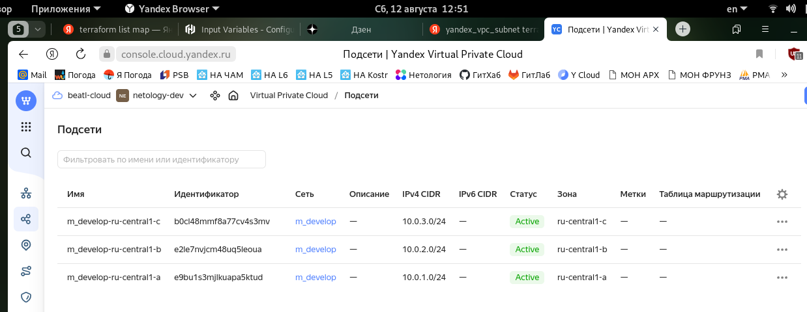

----

### Задание 5*

1. Напишите модуль для создания кластера managed БД Mysql в Yandex Cloud с одним или тремя хостами в зависимости от переменной HA=true или HA=false. Используйте ресурс yandex_mdb_mysql_cluster: передайте имя кластера и id сети.
2. Напишите модуль для создания базы данных и пользователя в уже существующем кластере managed БД Mysql. Используйте ресурсы yandex_mdb_mysql_database и yandex_mdb_mysql_user: передайте имя базы данных, имя пользователя и id кластера при вызове модуля.
3. Используя оба модуля, создайте кластер example из одного хоста, а затем добавьте в него БД test и пользователя app. Затем измените переменную и превратите сингл хост в кластер из 2-х серверов.
4. Предоставьте план выполнения и по возможности результат. Сразу же удаляйте созданные ресурсы, так как кластер может стоить очень дорого. Используйте минимальную конфигурацию.

### Решение 5

_Код модуля создания кластера /modules/my_claster/claster.tf_

```terraform
terraform {
  required_providers {
    yandex = {
      source = "yandex-cloud/yandex"
    }
  }
  required_version = ">= 0.13"
}

resource "yandex_vpc_subnet" "develop" {
  count = local.hosts_count
  name           = "develop-ru-central1-a-${count.index+1}"
  zone           = "ru-central1-a"
  network_id     = var.cl_params.net_id
  v4_cidr_blocks = ["10.0.${count.index+1}.0/24"]
}

resource "yandex_mdb_mysql_cluster" "example" {
  name        = var.cl_params.name
  environment = "PRESTABLE"
  network_id  = var.cl_params.net_id
  version     = "8.0"

  resources {
    resource_preset_id = "s2.micro"
    disk_type_id       = "network-ssd"
    disk_size          = 16
  }

  maintenance_window {
    type = "ANYTIME"
  }

  dynamic "host" {
    for_each = yandex_vpc_subnet.develop
    content {
      zone = host.value.zone
      subnet_id = host.value.id
      name = host.value.name
    }
  }
}

variable "is_one" {
  type = bool
  default = false
}

locals {
  hosts_count = var.is_one ? 1 : 3
}

variable "cl_params" {
  default = {
    name = "MySQL_claster"
    net_id = ""
  }
}

output "out_claster_id" {
  value=yandex_mdb_mysql_cluster.example.id
}
```

_Код модуля для БД и пользователя /modules/my_db/db.tf_

```terraform
terraform {
  required_providers {
    yandex = {
      source = "yandex-cloud/yandex"
    }
  }
  required_version = ">= 0.13"
}

resource "yandex_mdb_mysql_database" "test" {
  cluster_id = var.db_params.claster_id
  name       = var.db_params.db_name
}

resource "yandex_mdb_mysql_user" "app" {
  cluster_id = var.db_params.claster_id
  name       = var.db_params.db_user
  password   = var.db_params.db_pass
  permission {
    database_name = var.db_params.db_name
    roles         = ["ALL"]
  }
}

variable "db_params" {
  default = {
    db_name = "MyDB"
    claster_id = ""
    db_user = ""
    db_pass = ""
  }
}
```

_Код main.tf с вызовом модулей_

```terraform
resource "yandex_vpc_network" "develop" {
  name = "develop"
}

module "mysql_cl" {
  source = "./modules/my_claster"
  is_one = false
  cl_params = {
    name             = "Dev_cluster"
    net_id = yandex_vpc_network.develop.id
  }
 }

module "my_db_and_user" {
  source    = "./modules/my_db"
  db_params = {
    db_name = "MyTestDB"
    db_user = "app"
    db_pass = "derParol"
    claster_id = module.mysql_cl.out_claster_id
  }

}
```
_Вывод teraform apply для кластера с одним хостом_

```terraform
beatl@ProBookB:~/ter-homeworks/04/src$ terraform apply

Terraform used the selected providers to generate the following execution plan. Resource actions are indicated with the following symbols:
  + create

Terraform will perform the following actions:

  # yandex_vpc_network.develop will be created
  + resource "yandex_vpc_network" "develop" {
      + created_at                = (known after apply)
      + default_security_group_id = (known after apply)
      + folder_id                 = (known after apply)
      + id                        = (known after apply)
      + labels                    = (known after apply)
      + name                      = "develop"
      + subnet_ids                = (known after apply)
    }

  # module.my_db_and_user.yandex_mdb_mysql_database.test will be created
  + resource "yandex_mdb_mysql_database" "test" {
      + cluster_id = (known after apply)
      + id         = (known after apply)
      + name       = "MyTestDB"
    }

  # module.my_db_and_user.yandex_mdb_mysql_user.app will be created
  + resource "yandex_mdb_mysql_user" "app" {
      + authentication_plugin = (known after apply)
      + cluster_id            = (known after apply)
      + global_permissions    = (known after apply)
      + id                    = (known after apply)
      + name                  = "app"
      + password              = (sensitive value)

      + permission {
          + database_name = "MyTestDB"
          + roles         = [
              + "ALL",
            ]
        }
    }

  # module.mysql_cl.yandex_mdb_mysql_cluster.example will be created
  + resource "yandex_mdb_mysql_cluster" "example" {
      + allow_regeneration_host   = false
      + backup_retain_period_days = (known after apply)
      + created_at                = (known after apply)
      + deletion_protection       = (known after apply)
      + environment               = "PRESTABLE"
      + folder_id                 = (known after apply)
      + health                    = (known after apply)
      + host_group_ids            = (known after apply)
      + id                        = (known after apply)
      + mysql_config              = (known after apply)
      + name                      = "Dev_cluster"
      + network_id                = (known after apply)
      + status                    = (known after apply)
      + version                   = "8.0"

      + host {
          + assign_public_ip   = false
          + fqdn               = (known after apply)
          + name               = "develop-ru-central1-a-1"
          + replication_source = (known after apply)
          + subnet_id          = (known after apply)
          + zone               = "ru-central1-a"
        }

      + maintenance_window {
          + type = "ANYTIME"
        }

      + resources {
          + disk_size          = 16
          + disk_type_id       = "network-ssd"
          + resource_preset_id = "s2.micro"
        }
    }

  # module.mysql_cl.yandex_vpc_subnet.develop[0] will be created
  + resource "yandex_vpc_subnet" "develop" {
      + created_at     = (known after apply)
      + folder_id      = (known after apply)
      + id             = (known after apply)
      + labels         = (known after apply)
      + name           = "develop-ru-central1-a-1"
      + network_id     = (known after apply)
      + v4_cidr_blocks = [
          + "10.0.1.0/24",
        ]
      + v6_cidr_blocks = (known after apply)
      + zone           = "ru-central1-a"
    }

Plan: 5 to add, 0 to change, 0 to destroy.

Do you want to perform these actions?
  Terraform will perform the actions described above.
  Only 'yes' will be accepted to approve.

  Enter a value: yes

yandex_vpc_network.develop: Creating...
yandex_vpc_network.develop: Creation complete after 4s [id=enpn3mp2i2omaur0qr1j]
module.mysql_cl.yandex_vpc_subnet.develop[0]: Creating...
module.mysql_cl.yandex_vpc_subnet.develop[0]: Creation complete after 2s [id=e9b3mjtvdm3lqgqnut2q]
module.mysql_cl.yandex_mdb_mysql_cluster.example: Creating...
module.mysql_cl.yandex_mdb_mysql_cluster.example: Still creating... [10s elapsed]
        --- skip ---
module.mysql_cl.yandex_mdb_mysql_cluster.example: Still creating... [7m30s elapsed]
module.mysql_cl.yandex_mdb_mysql_cluster.example: Creation complete after 7m38s [id=c9qhji66ueaqvte1d8eu]
module.my_db_and_user.yandex_mdb_mysql_database.test: Creating...
module.my_db_and_user.yandex_mdb_mysql_user.app: Creating...
module.my_db_and_user.yandex_mdb_mysql_database.test: Still creating... [10s elapsed]
module.my_db_and_user.yandex_mdb_mysql_user.app: Still creating... [10s elapsed]
module.my_db_and_user.yandex_mdb_mysql_user.app: Still creating... [20s elapsed]
module.my_db_and_user.yandex_mdb_mysql_database.test: Still creating... [20s elapsed]
module.my_db_and_user.yandex_mdb_mysql_database.test: Creation complete after 21s [id=c9qhji66ueaqvte1d8eu:MyTestDB]
module.my_db_and_user.yandex_mdb_mysql_user.app: Still creating... [30s elapsed]
        --- skip ---
module.my_db_and_user.yandex_mdb_mysql_user.app: Still creating... [1m20s elapsed]
module.my_db_and_user.yandex_mdb_mysql_user.app: Creation complete after 1m25s [id=c9qhji66ueaqvte1d8eu:app]

Apply complete! Resources: 5 added, 0 changed, 0 destroyed.
```

_Скриншот ресурсов облака с кластером с 1 хостом_

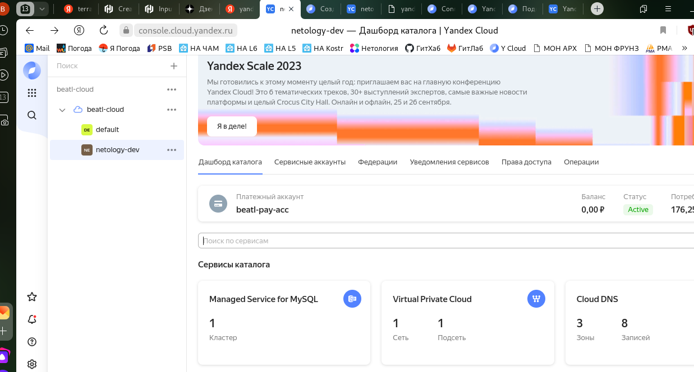

_Скриншот кластера с 1 хостом_

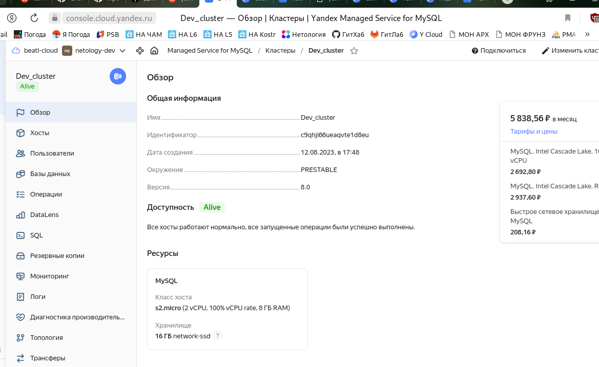

_Скриншот хостов кластера с 1 хостом_

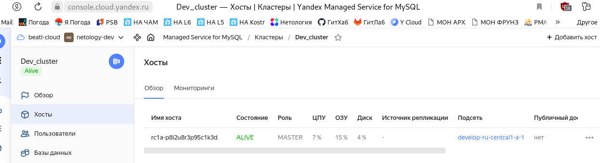

_Скриншот пользователей кластера с 1 хостом_

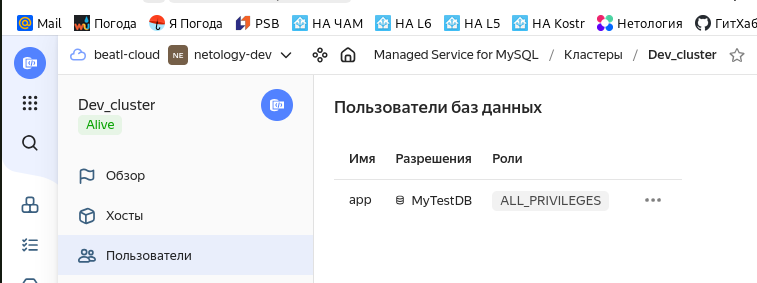

_Скриншот баз данных кластера с 1 хостом_

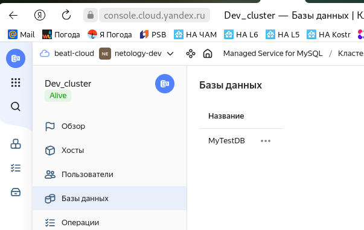

_Вывод teraform apply для кластера с тремя хостами_

```terraform
beatl@ProBookB:~/ter-homeworks/04/src$ terraform apply

Terraform used the selected providers to generate the following execution plan. Resource actions are indicated with the following symbols:
  + create

Terraform will perform the following actions:

  # yandex_vpc_network.develop will be created
  + resource "yandex_vpc_network" "develop" {
      + created_at                = (known after apply)
      + default_security_group_id = (known after apply)
      + folder_id                 = (known after apply)
      + id                        = (known after apply)
      + labels                    = (known after apply)
      + name                      = "develop"
      + subnet_ids                = (known after apply)
    }

  # module.my_db_and_user.yandex_mdb_mysql_database.test will be created
  + resource "yandex_mdb_mysql_database" "test" {
      + cluster_id = (known after apply)
      + id         = (known after apply)
      + name       = "MyTestDB"
    }

  # module.my_db_and_user.yandex_mdb_mysql_user.app will be created
  + resource "yandex_mdb_mysql_user" "app" {
      + authentication_plugin = (known after apply)
      + cluster_id            = (known after apply)
      + global_permissions    = (known after apply)
      + id                    = (known after apply)
      + name                  = "app"
      + password              = (sensitive value)

      + permission {
          + database_name = "MyTestDB"
          + roles         = [
              + "ALL",
            ]
        }
    }

  # module.mysql_cl.yandex_mdb_mysql_cluster.example will be created
  + resource "yandex_mdb_mysql_cluster" "example" {
      + allow_regeneration_host   = false
      + backup_retain_period_days = (known after apply)
      + created_at                = (known after apply)
      + deletion_protection       = (known after apply)
      + environment               = "PRESTABLE"
      + folder_id                 = (known after apply)
      + health                    = (known after apply)
      + host_group_ids            = (known after apply)
      + id                        = (known after apply)
      + mysql_config              = (known after apply)
      + name                      = "Dev_cluster"
      + network_id                = (known after apply)
      + status                    = (known after apply)
      + version                   = "8.0"

      + host {
          + assign_public_ip   = false
          + fqdn               = (known after apply)
          + name               = "develop-ru-central1-a-1"
          + replication_source = (known after apply)
          + subnet_id          = (known after apply)
          + zone               = "ru-central1-a"
        }
      + host {
          + assign_public_ip   = false
          + fqdn               = (known after apply)
          + name               = "develop-ru-central1-a-2"
          + replication_source = (known after apply)
          + subnet_id          = (known after apply)
          + zone               = "ru-central1-a"
        }
      + host {
          + assign_public_ip   = false
          + fqdn               = (known after apply)
          + name               = "develop-ru-central1-a-3"
          + replication_source = (known after apply)
          + subnet_id          = (known after apply)
          + zone               = "ru-central1-a"
        }

      + maintenance_window {
          + type = "ANYTIME"
        }

      + resources {
          + disk_size          = 16
          + disk_type_id       = "network-ssd"
          + resource_preset_id = "s2.micro"
        }
    }

  # module.mysql_cl.yandex_vpc_subnet.develop[0] will be created
  + resource "yandex_vpc_subnet" "develop" {
      + created_at     = (known after apply)
      + folder_id      = (known after apply)
      + id             = (known after apply)
      + labels         = (known after apply)
      + name           = "develop-ru-central1-a-1"
      + network_id     = (known after apply)
      + v4_cidr_blocks = [
          + "10.0.1.0/24",
        ]
      + v6_cidr_blocks = (known after apply)
      + zone           = "ru-central1-a"
    }

  # module.mysql_cl.yandex_vpc_subnet.develop[1] will be created
  + resource "yandex_vpc_subnet" "develop" {
      + created_at     = (known after apply)
      + folder_id      = (known after apply)
      + id             = (known after apply)
      + labels         = (known after apply)
      + name           = "develop-ru-central1-a-2"
      + network_id     = (known after apply)
      + v4_cidr_blocks = [
          + "10.0.2.0/24",
        ]
      + v6_cidr_blocks = (known after apply)
      + zone           = "ru-central1-a"
    }

  # module.mysql_cl.yandex_vpc_subnet.develop[2] will be created
  + resource "yandex_vpc_subnet" "develop" {
      + created_at     = (known after apply)
      + folder_id      = (known after apply)
      + id             = (known after apply)
      + labels         = (known after apply)
      + name           = "develop-ru-central1-a-3"
      + network_id     = (known after apply)
      + v4_cidr_blocks = [
          + "10.0.3.0/24",
        ]
      + v6_cidr_blocks = (known after apply)
      + zone           = "ru-central1-a"
    }

Plan: 7 to add, 0 to change, 0 to destroy.

Do you want to perform these actions?
  Terraform will perform the actions described above.
  Only 'yes' will be accepted to approve.

  Enter a value: yes

yandex_vpc_network.develop: Creating...
yandex_vpc_network.develop: Creation complete after 3s [id=enppri9dgl9heqj4gde0]
module.mysql_cl.yandex_vpc_subnet.develop[1]: Creating...
module.mysql_cl.yandex_vpc_subnet.develop[2]: Creating...
module.mysql_cl.yandex_vpc_subnet.develop[0]: Creating...
module.mysql_cl.yandex_vpc_subnet.develop[1]: Creation complete after 1s [id=e9be33dotq80jogfmh56]
module.mysql_cl.yandex_vpc_subnet.develop[0]: Creation complete after 2s [id=e9bub5paktphdbmghi6v]
module.mysql_cl.yandex_vpc_subnet.develop[2]: Creation complete after 3s [id=e9bvbuh26issortqdtad]
module.mysql_cl.yandex_mdb_mysql_cluster.example: Creating...
module.mysql_cl.yandex_mdb_mysql_cluster.example: Still creating... [10s elapsed]
            --- skip ---
module.mysql_cl.yandex_mdb_mysql_cluster.example: Still creating... [8m30s elapsed]
module.mysql_cl.yandex_mdb_mysql_cluster.example: Creation complete after 8m32s [id=c9qu3qkm6q8fgn7mva8s]
module.my_db_and_user.yandex_mdb_mysql_database.test: Creating...
module.my_db_and_user.yandex_mdb_mysql_user.app: Creating...
module.my_db_and_user.yandex_mdb_mysql_database.test: Still creating... [10s elapsed]
module.my_db_and_user.yandex_mdb_mysql_database.test: Still creating... [20s elapsed]
module.my_db_and_user.yandex_mdb_mysql_database.test: Creation complete after 21s [id=c9qu3qkm6q8fgn7mva8s:MyTestDB]
module.my_db_and_user.yandex_mdb_mysql_user.app: Creation complete after 1m32s [id=c9qhji66ueaqvte1d8eu:app]

Apply complete! Resources: 7 added, 0 changed, 0 destroyed.
```

_Скриншот ресурсов облака с кластером с 3 хостоми_

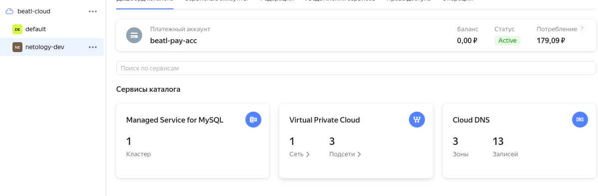

_Скриншот кластера с 3 хостами_

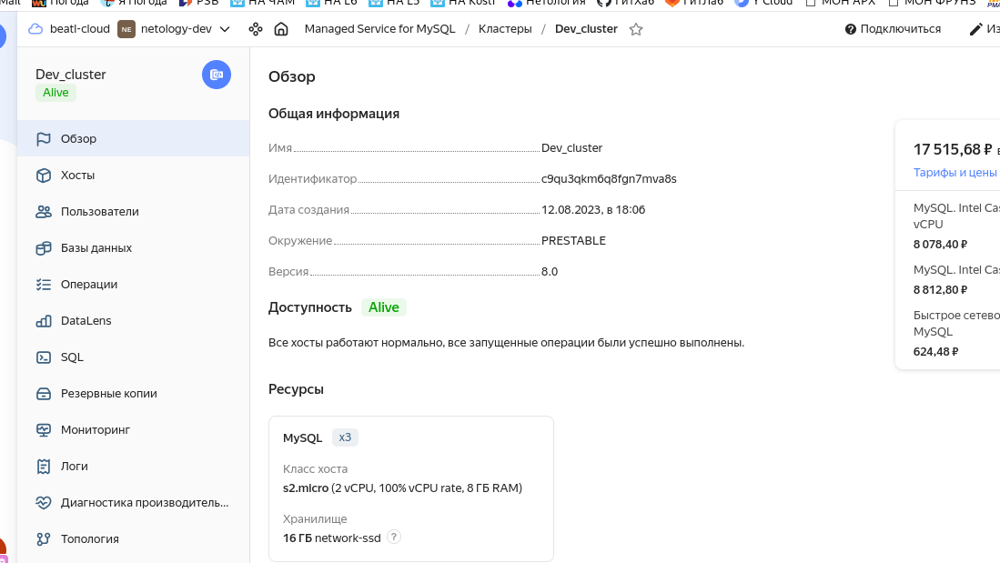

_Скриншот хостов кластера с 3 хостами_

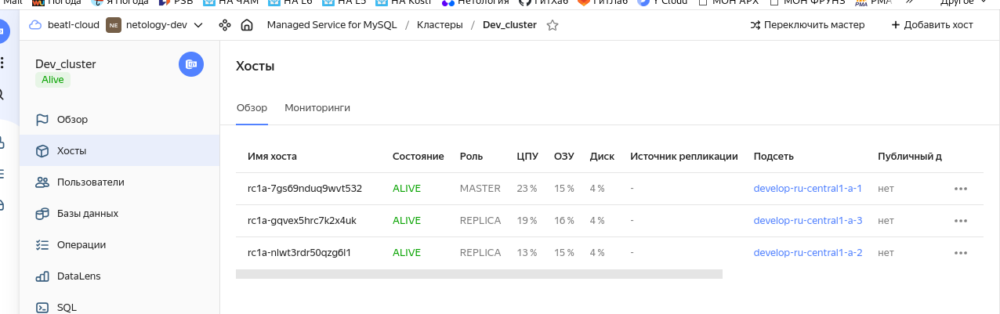

----

### Задание 6*

1. Разверните у себя локально vault, используя docker-compose.yml в проекте.
2. Для входа в web-интерфейс и авторизации terraform в vault используйте токен "education".
3. Создайте новый секрет по пути http://127.0.0.1:8200/ui/vault/secrets/secret/create
Path: example  
secret data key: test 
secret data value: congrats!  
4. Считайте этот секрет с помощью terraform и выведите его в output по примеру:

### Решение 6

_Скриншот vault_

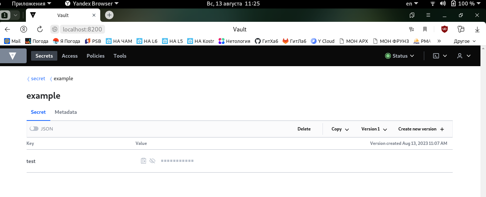

_Вывод terraform:_

```terraform
beatl@ProBookB:~/ter-homeworks/04/src$ terraform apply
data.vault_generic_secret.vault_example: Reading...
data.vault_generic_secret.vault_example: Read complete after 1s [id=secret/example]

Changes to Outputs:
  + vault_example = {
      + test = "Congrats!"
    }

You can apply this plan to save these new output values to the Terraform state, without changing any real infrastructure.

Do you want to perform these actions?
  Terraform will perform the actions described above.
  Only 'yes' will be accepted to approve.

  Enter a value: yes

Apply complete! Resources: 0 added, 0 changed, 0 destroyed.

Outputs:

vault_example = tomap({
  "test" = "Congrats!"
})
```

6. Попробуйте самостоятельно разобраться в документации и записать новый секрет в vault с помощью terraform. 

_Код чтения и записи секретов_

```terraform
data "vault_generic_secret" "vault_example"{
 path = "secret/example"
}

resource "vault_generic_secret" "my_secret" {
  path = "secret/very_imprtant"

  data_json = <<EOT
{
  "sec1":   "very big secret",
  "sec2":   "another big secret"
}
EOT
}

output "vault_example" {
 value = "${nonsensitive(data.vault_generic_secret.vault_example.data)}"
}
```
_Вывод terraform apply_

```terraform
beatl@ProBookB:~/ter-homeworks/04/src$ terraform apply
data.vault_generic_secret.vault_example: Reading...
data.vault_generic_secret.vault_example: Read complete after 0s [id=secret/example]

Terraform used the selected providers to generate the following execution plan. Resource actions are indicated with the following symbols:
  + create

Terraform will perform the following actions:

  # vault_generic_secret.my_secret will be created
  + resource "vault_generic_secret" "my_secret" {
      + data                = (sensitive value)
      + data_json           = (sensitive value)
      + delete_all_versions = false
      + disable_read        = false
      + id                  = (known after apply)
      + path                = "secret/very_imprtant"
    }

Plan: 1 to add, 0 to change, 0 to destroy.

Do you want to perform these actions?
  Terraform will perform the actions described above.
  Only 'yes' will be accepted to approve.

  Enter a value: yes

vault_generic_secret.my_secret: Creating...
vault_generic_secret.my_secret: Creation complete after 0s [id=secret/very_imprtant]

Apply complete! Resources: 1 added, 0 changed, 0 destroyed.

Outputs:

vault_example = tomap({
  "test" = "Congrats!"
})
```

_Скриншот сервера Vault_

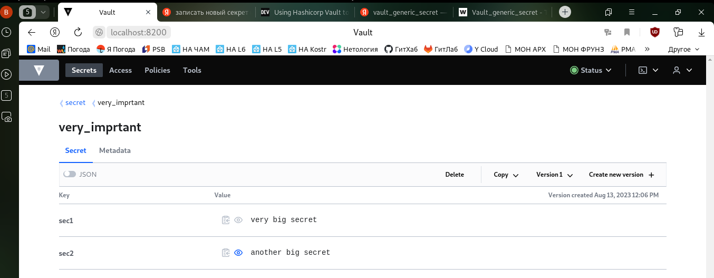

-----