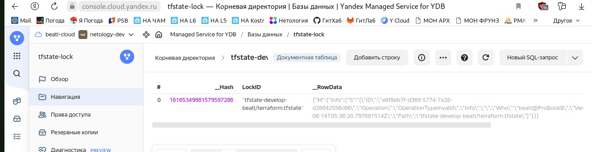
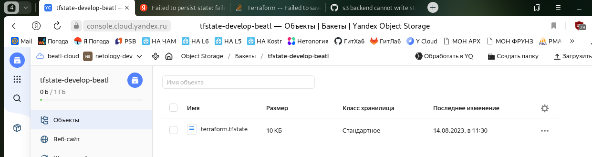

# Домашнее задание к занятию «Использование Terraform в команде»

### Цели задания

1. Научиться использовать remote state.
2. Освоить приёмы командной работы.


### Чек-лист готовности к домашнему заданию

1. Зарегистрирован аккаунт в Yandex Cloud. Использован промокод на грант.
2. Установлен инструмент Yandex CLI.
3. Любые ВМ, использованные при выполнении задания, должны быть прерываемыми, для экономии средств.

------

### Задание 1

1. Возьмите код:
- из [ДЗ к лекции 4](https://github.com/netology-code/ter-homeworks/tree/main/04/src),
- из [демо к лекции 4](https://github.com/netology-code/ter-homeworks/tree/main/04/demonstration1).
2. Проверьте код с помощью tflint и checkov. Вам не нужно инициализировать этот проект.
3. Перечислите, какие **типы** ошибок обнаружены в проекте (без дублей).

### Решение 1

_Ошибки от tflint_

```
Warning: [Fixable] Interpolation-only expressions are deprecated in Terraform v0.12.14
Warning: Missing version constraint for provider "*******" in `required_providers`
Warning: [Fixable] variable "*******" is declared but not used 
```

_Ошибки от checkov_

```
Check: CKV_YC_1: "Ensure security group is assigned to database cluster."
        FAILED for resource: yandex_mdb_mysql_cluster.example

Check: CKV_SECRET_6: "Base64 High Entropy String"
        FAILED for resource: 24e7451df05ed5cd4cf1041be67c68f8d89d087a
```

------

### Задание 2

1. Возьмите ваш GitHub-репозиторий с **выполненным ДЗ 4** в ветке 'terraform-04' и сделайте из него ветку 'terraform-05'.
2. Повторите демонстрацию лекции: настройте YDB, S3 bucket, yandex service account, права доступа и мигрируйте state проекта в S3 с блокировками. Предоставьте скриншоты процесса в качестве ответа.
3. Закоммитьте в ветку 'terraform-05' все изменения.
4. Откройте в проекте terraform console, а в другом окне из этой же директории попробуйте запустить terraform apply.
5. Пришлите ответ об ошибке доступа к state.
6. Принудительно разблокируйте state. Пришлите команду и вывод.

### Решение 2

_Вывод terraform init_

```
beatl@ProBookB:~/ter-homeworks/04/src$ terraform init -backend-config="access_key=*x*x*x*x*x*x" -backend-config="secret_key=x**x*x*x**x*x*x*x*"

Initializing the backend...
Initializing modules...

Initializing provider plugins...
- Reusing previous version of hashicorp/template from the dependency lock file
- Reusing previous version of yandex-cloud/yandex from the dependency lock file
- Using previously-installed hashicorp/template v2.2.0
- Using previously-installed yandex-cloud/yandex v0.96.1

Terraform has made some changes to the provider dependency selections recorded
in the .terraform.lock.hcl file. Review those changes and commit them to your
version control system if they represent changes you intended to make.

Terraform has been successfully initialized!

You may now begin working with Terraform. Try running "terraform plan" to see
any changes that are required for your infrastructure. All Terraform commands
should now work.

If you ever set or change modules or backend configuration for Terraform,
rerun this command to reinitialize your working directory. If you forget, other
commands will detect it and remind you to do so if necessary.
```

_Вывод terraform plan_

```
beatl@ProBookB:~/ter-homeworks/04/src$ terraform plan
Acquiring state lock. This may take a few moments...
data.template_file.cloudinit: Reading...
data.template_file.cloudinit: Read complete after 0s [id=88494dac047b6257c9dc09991d8e634b2f3574b5fe9f8beed31c079c755e4c51]
module.test-vm.data.yandex_compute_image.my_image: Reading...
module.test-vm.data.yandex_compute_image.my_image: Read complete after 3s [id=fd8h5v894psivbl4t2dn]

Terraform used the selected providers to generate the following execution plan. Resource actions are indicated with the following symbols:
  + create

Terraform will perform the following actions:

  # yandex_vpc_network.develop will be created
  + resource "yandex_vpc_network" "develop" {
      + created_at                = (known after apply)
      + default_security_group_id = (known after apply)
      + folder_id                 = (known after apply)
      + id                        = (known after apply)
      + labels                    = (known after apply)
      + name                      = "develop"
      + subnet_ids                = (known after apply)
    }

  # yandex_vpc_subnet.develop will be created
  + resource "yandex_vpc_subnet" "develop" {
      + created_at     = (known after apply)
      + folder_id      = (known after apply)
      + id             = (known after apply)
      + labels         = (known after apply)
      + name           = "develop-ru-central1-a"
      + network_id     = (known after apply)
      + v4_cidr_blocks = [
          + "10.0.1.0/24",
        ]
      + v6_cidr_blocks = (known after apply)
      + zone           = "ru-central1-a"
    }

  # module.test-vm.yandex_compute_instance.vm[0] will be created
  + resource "yandex_compute_instance" "vm" {
      + allow_stopping_for_update = true
      + created_at                = (known after apply)
      + description               = "TODO: description; {{terraform managed}}"
      + folder_id                 = (known after apply)
      + fqdn                      = (known after apply)
      + gpu_cluster_id            = (known after apply)
      + hostname                  = "develop-web-0"
      + id                        = (known after apply)
      + labels                    = {
          + "env"     = "develop"
          + "project" = "undefined"
        }
      + metadata                  = {
          + "serial-port-enable" = "1"
          + "user-data"          = <<-EOT
                #cloud-config
                users:
                  - name: ubuntu
                    groups: sudo
                    shell: /bin/bash
                    sudo: ['ALL=(ALL) NOPASSWD:ALL']
                    ssh_authorized_keys:
                      - "ssh-ed25519 AAAAC3NzaC1lZDI1NTE5AAAAILroHnVVBk9mPo8RNp6OEy2yfY47sOhO4WhtixAINpNS beatl@ProBookB
                "
                      - "ssh-rsa AAAAB3NzaC1yc2EAAAADAQABAAABgQDhSV7Ub5OKiYZm6e/w0cb8MQb+7R4E+yPNWT4moppbmfn8CJBXIp0xdiAmYiZYReUDEqZH0lYqxgQH5Or2MtyNC+MnISOttyF7oRSCUWdpfiJshpQfw/wLkmLqnWmQdovgTfPu5KW5yZYU0opGUv+Zgybqy3okbQURsI8ypXXSvv4ARzyLOJu5mTui822b1Pr7HI/Kxug9nMtKJs/AHuf5lnqQKp/Jt+fYeZuxHGKJ1Ynv+n7GWnmSV/pYjkG4Om6wOjBvPEq+hO+paaGQSe5EGY6+pKam4WMFjRiCUgrk5Haw5kfmw61todMrUZ7Hdwx/uqH2aQM8b47zveidMjPARQ+unqL6X/j/qhFOuFH6ObQJ76s/QTZiqgx6lQilU/i1hu3R3EpVJ3RqwqPFxOCl8TDt0em6Fco5AjgBlG3VGEnkcXqHPvK3befI7GVqaWUgvRzcYJrgtdykEU4xhXYTJh8lturr6mno3YIRzw6mUMwfABvODrIgCm7kWwkcSAs= beatl@ProBookB
                "
                package_update: true
                package_upgrade: false
                packages:
                 - vim
                 - nginx
            EOT
        }
      + name                      = "develop-web-0"
      + network_acceleration_type = "standard"
      + platform_id               = "standard-v1"
      + service_account_id        = (known after apply)
      + status                    = (known after apply)
      + zone                      = "ru-central1-a"

      + boot_disk {
          + auto_delete = true
          + device_name = (known after apply)
          + disk_id     = (known after apply)
          + mode        = (known after apply)

          + initialize_params {
              + block_size  = (known after apply)
              + description = (known after apply)
              + image_id    = "fd8h5v894psivbl4t2dn"
              + name        = (known after apply)
              + size        = 10
              + snapshot_id = (known after apply)
              + type        = "network-hdd"
            }
        }

      + network_interface {
          + index              = (known after apply)
          + ip_address         = (known after apply)
          + ipv4               = true
          + ipv6               = (known after apply)
          + ipv6_address       = (known after apply)
          + mac_address        = (known after apply)
          + nat                = true
          + nat_ip_address     = (known after apply)
          + nat_ip_version     = (known after apply)
          + security_group_ids = (known after apply)
          + subnet_id          = (known after apply)
        }

      + resources {
          + core_fraction = 5
          + cores         = 2
          + memory        = 1
        }

      + scheduling_policy {
          + preemptible = true
        }
    }

Plan: 3 to add, 0 to change, 0 to destroy.

Note: You didn't use the -out option to save this plan, so Terraform can't guarantee to take exactly these actions if you run "terraform apply" now.
Releasing state lock. This may take a few moments...
```

_Блокируем stste_

```
beatl@ProBookB:~/ter-homeworks/04/src$ terraform console
Acquiring state lock. This may take a few moments...

>
```

_Вывод terraform plan из другого окна консоли_


```
beatl@ProBookB:~/ter-homeworks/04/src$ terraform plan
Acquiring state lock. This may take a few moments...
╷
│ Error: Error acquiring the state lock
│ 
│ Error message: ConditionalCheckFailedException: Condition not satisfied
│ Lock Info:
│   ID:        e6f8eb7f-d369-5774-7a28-d28842556c66
│   Path:      tfstate-develop-beatl/terraform.tfstate
│   Operation: OperationTypeInvalid
│   Who:       beatl@ProBookB
│   Version:   1.5.5
│   Created:   2023-08-14 05:38:20.797081514 +0000 UTC
│   Info:      
│ 
│ 
│ Terraform acquires a state lock to protect the state from being written
│ by multiple users at the same time. Please resolve the issue above and try
│ again. For most commands, you can disable locking with the "-lock=false"
│ flag, but this is not recommended.
╵
```

_Скриншоты содержимого базы YDB и bucket_





_Разблокируем stste из первой консоли_

```
> ^C
Releasing state lock. This may take a few moments...
beatl@ProBookB:~/ter-homeworks/04/src$ 
```

_Terraform plan из другого окна консоли без ошибок выполняется.
Запись блокировки в YDB исчезла_

```
beatl@ProBookB:~/ter-homeworks/04/src$ terraform plan
Acquiring state lock. This may take a few moments...
data.template_file.cloudinit: Reading...
data.template_file.cloudinit: Read complete after 0s [id=88494dac047b6257c9dc09991d8e634b2f3574b5fe9f8beed31c079c755e4c51]
module.test-vm.data.yandex_compute_image.my_image: Reading...
module.test-vm.data.yandex_compute_image.my_image: Read complete after 2s [id=fd8h5v894psivbl4t2dn]

Terraform used the selected providers to generate the following execution plan. Resource actions are indicated with the following symbols:
  + create

Terraform will perform the following actions:
           ------ Skip ------
```

_А вот разблокировка по рекомедации из лекции не сработала!_

```shell
beatl@ProBookB:~/ter-homeworks/04/src$ terraform state pull > ~/test.tfstate
beatl@ProBookB:~/ter-homeworks/04/src$ terraform console -state=~/test.tfstate
Acquiring state lock. This may take a few moments...
╷
│ Error: Error acquiring the state lock
│ 
│ Error message: ConditionalCheckFailedException: Condition not satisfied
│ Lock Info:
│   ID:        4a592016-40ae-ea83-1c1f-942b2bfb472c
│   Path:      tfstate-develop-beatl/terraform.tfstate
│   Operation: OperationTypeInvalid
│   Who:       beatl@ProBookB
│   Version:   1.5.5
│   Created:   2023-08-14 08:35:58.433039871 +0000 UTC
│   Info:      
│ 
│ 
│ Terraform acquires a state lock to protect the state from being written
│ by multiple users at the same time. Please resolve the issue above and try
│ again. For most commands, you can disable locking with the "-lock=false"
│ flag, but this is not recommended.
```

_Удалось разблокировать другим методом_

```shell
beatl@ProBookB:~/ter-homeworks/04/src$ terraform force-unlock 4a592016-40ae-ea83-1c1f-942b2bfb472c
Do you really want to force-unlock?
  Terraform will remove the lock on the remote state.
  This will allow local Terraform commands to modify this state, even though it
  may still be in use. Only 'yes' will be accepted to confirm.

  Enter a value: yes

Terraform state has been successfully unlocked!

The state has been unlocked, and Terraform commands should now be able to
obtain a new lock on the remote state.
```

------

### Задание 3  

1. Сделайте в GitHub из ветки 'terraform-05' новую ветку 'terraform-hotfix'.
2. Проверье код с помощью tflint и checkov, исправьте все предупреждения и ошибки в 'terraform-hotfix', сделайте коммит.
3. Откройте новый pull request 'terraform-hotfix' --> 'terraform-05'. 
4. Вставьте в комментарий PR результат анализа tflint и checkov, план изменений инфраструктуры из вывода команды terraform plan.
5. Пришлите ссылку на PR для ревью. Вливать код в 'terraform-05' не нужно.

------
### Задание 4

1. Напишите переменные с валидацией и протестируйте их, заполнив default верными и неверными значениями. Предоставьте скриншоты проверок из terraform console. 

- type=string, description="ip-адрес" — проверка, что значение переменной содержит верный IP-адрес с помощью функций cidrhost() или regex(). Тесты:  "192.168.0.1" и "1920.1680.0.1";
- type=list(string), description="список ip-адресов" — проверка, что все адреса верны. Тесты:  ["192.168.0.1", "1.1.1.1", "127.0.0.1"] и ["192.168.0.1", "1.1.1.1", "1270.0.0.1"].

## Дополнительные задания (со звёздочкой*)

**Настоятельно рекомендуем выполнять все задания со звёздочкой.** Их выполнение поможет глубже разобраться в материале.   
Задания со звёздочкой дополнительные, не обязательные к выполнению и никак не повлияют на получение вами зачёта по этому домашнему заданию. 
------
### Задание 5*
1. Напишите переменные с валидацией:
- type=string, description="любая строка" — проверка, что строка не содержит символов верхнего регистра;
- type=object — проверка, что одно из значений равно true, а второе false, т. е. не допускается false false и true true:
```
variable "in_the_end_there_can_be_only_one" {
    description="Who is better Connor or Duncan?"
    type = object({
        Dunkan = optional(bool)
        Connor = optional(bool)
    })

    default = {
        Dunkan = true
        Connor = false
    }

    validation {
        error_message = "There can be only one MacLeod"
        condition = <проверка>
    }
}
```
------
### Задание 6*

1. Настройте любую известную вам CI/CD-систему. Если вы ещё не знакомы с CI/CD-системами, настоятельно рекомендуем вернуться к этому заданию после изучения Jenkins/Teamcity/Gitlab.
2. Скачайте с её помощью ваш репозиторий с кодом и инициализируйте инфраструктуру.
3. Уничтожьте инфраструктуру тем же способом.


### Правила приёма работы

Ответы на задания и необходимые скриншоты оформите в md-файле в ветке terraform-05.

В качестве результата прикрепите ссылку на ветку terraform-05 в вашем репозитории.

**Важно.** Удалите все созданные ресурсы.

### Критерии оценки

Зачёт ставится, если:

* выполнены все задания,
* ответы даны в развёрнутой форме,
* приложены соответствующие скриншоты и файлы проекта,
* в выполненных заданиях нет противоречий и нарушения логики.

На доработку работу отправят, если:

* задание выполнено частично или не выполнено вообще,
* в логике выполнения заданий есть противоречия и существенные недостатки. 




